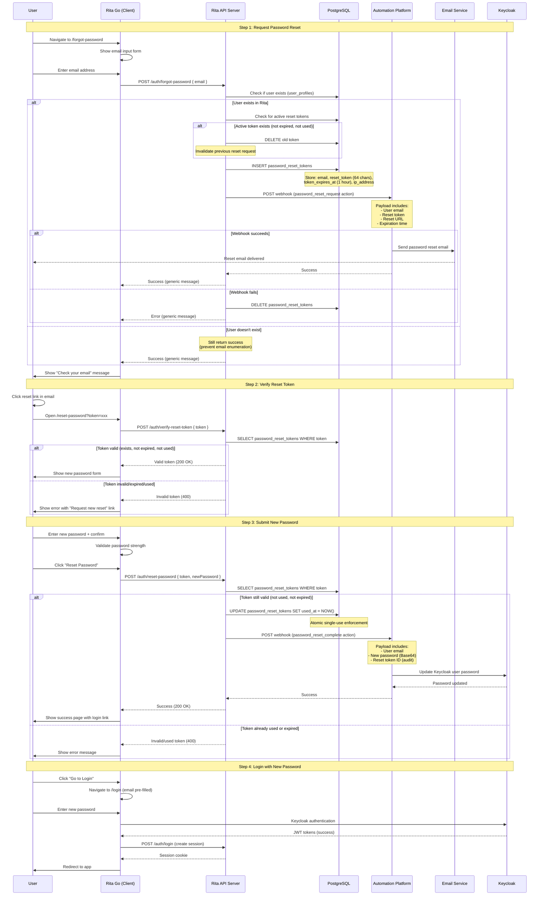

# Rita Password Reset System - Design Document

## Overview

This document describes the password reset system that allows users who have forgotten their password to securely reset it via email verification. The system integrates with Rita's existing webhook-based authentication architecture and maintains the **zero-storage password model**.

**Key Philosophy**: Passwords are **NEVER stored in Rita database** at any point - they flow directly from client → API (memory only) → Webhook → Keycloak.

### Flow Comparison with Existing Systems

| System | Entry Point | Verification Method | Password Handling | Result |
|--------|-------------|---------------------|-------------------|--------|
| **Signup** | `/signup` page | Email verification token (24h) | Base64 → Webhook → Keycloak | New account created |
| **Invitation** | Email link with token | Invitation token (7 days) | Base64 → Webhook → Keycloak | Account created + org membership |
| **Password Reset** | `/forgot-password` page | Reset token (1 hour) | Base64 → Webhook → Keycloak | Existing password updated |

## Architecture Alignment

This system follows Rita's established patterns:
- **Zero-storage password architecture** - Passwords never stored in Rita database (even temporarily)
- **Webhook-driven flow** - External automation platform handles Keycloak operations and email delivery
- **Token-based security** - Cryptographically secure single-use tokens with expiration
- **Cookie-only authentication** - No auth required for reset flow (public endpoints)
- **Audit logging** - SOC2-compliant tracking of all password reset actions

## Database Schema

### New Table: `password_reset_tokens`

```sql
CREATE TABLE password_reset_tokens (
  id UUID PRIMARY KEY DEFAULT gen_random_uuid(),
  user_email TEXT NOT NULL,
  reset_token TEXT NOT NULL UNIQUE,
  token_expires_at TIMESTAMP WITH TIME ZONE NOT NULL,
  created_at TIMESTAMP WITH TIME ZONE DEFAULT NOW(),
  used_at TIMESTAMP WITH TIME ZONE,
  ip_address TEXT,
  user_agent TEXT,

  CONSTRAINT token_expiry_valid CHECK (token_expires_at > created_at)
);

-- Indexes for performance
CREATE INDEX idx_password_reset_tokens_email ON password_reset_tokens(user_email);
CREATE INDEX idx_password_reset_tokens_token ON password_reset_tokens(reset_token);
CREATE INDEX idx_password_reset_tokens_expires_at ON password_reset_tokens(token_expires_at);

-- Prevent multiple active tokens per email (only one valid reset at a time)
CREATE UNIQUE INDEX idx_password_reset_tokens_unique_active_email
  ON password_reset_tokens(user_email)
  WHERE used_at IS NULL AND token_expires_at > NOW();

COMMENT ON TABLE password_reset_tokens IS 'Stores password reset tokens with single-use enforcement';
COMMENT ON COLUMN password_reset_tokens.reset_token IS '64-character hex token sent via email for password reset';
COMMENT ON COLUMN password_reset_tokens.used_at IS 'Timestamp when token was used (single-use enforcement)';
```

### Modifications to Existing Tables

**No modifications needed** - Password reset operates independently of existing user tables:
- `user_profiles` - Used to verify email exists before sending reset link
- `pending_users` - NOT involved (password reset is for existing verified users only)
- `pending_invitations` - NOT involved (separate flow)

## System Flow

### High-Level Password Reset Flow



## Detailed Flow by Stage

### Stage 1: Request Password Reset

**API Endpoint**: `POST /auth/forgot-password`

**Purpose**: Generate reset token and trigger email delivery

**Request**:
```typescript
{
  email: string // User's email address
}
```

**Process** (All validations must pass):

1. **Email Format Validation**: Verify email is valid format
   - If invalid → `400 Bad Request` ("Invalid email format")
2. **User Existence Check**: Query `user_profiles` for email
   ```typescript
   const userResult = await pool.query(
     `SELECT user_id, email FROM user_profiles WHERE email = $1`,
     [email]
   );

   if (userResult.rows.length === 0) {
     // User doesn't exist - still return success (prevent enumeration)
     return res.json({
       success: true,
       message: "If an account exists with this email, a password reset link will be sent"
     });
   }
   ```
3. **Active Token Cleanup**: Delete any existing active reset tokens for this email
   ```typescript
   // Only one active reset per email at a time
   await pool.query(
     `DELETE FROM password_reset_tokens
      WHERE user_email = $1 AND used_at IS NULL`,
     [email]
   );
   ```
4. **Rate Limiting**: Check if too many requests from same IP/email
   - Max 3 reset requests per email per hour
   - Max 10 reset requests per IP per hour
5. **Opportunistic Cleanup & Token Creation**: Clean old tokens and create new one in transaction
   ```typescript
   const client = await pool.connect();

   try {
     await client.query('BEGIN');

     // Opportunistic cleanup: Remove old tokens before inserting new one
     // This eliminates the need for a separate cron job
     await client.query(`
       DELETE FROM password_reset_tokens
       WHERE (
         -- Delete expired tokens (>24 hours past expiration)
         token_expires_at < NOW() - INTERVAL '24 hours'
       ) OR (
         -- Delete old used tokens (>7 days old)
         used_at IS NOT NULL AND used_at < NOW() - INTERVAL '7 days'
       )
     `);

     // Delete any existing active tokens for this email (only one active reset per user)
     await client.query(
       `DELETE FROM password_reset_tokens
        WHERE user_email = $1 AND used_at IS NULL`,
       [email]
     );

     // Generate and insert new token
     const resetToken = crypto.randomBytes(32).toString('hex'); // 64 chars
     const expiresAt = new Date(Date.now() + 60 * 60 * 1000); // 1 hour
     const ipAddress = req.ip;
     const userAgent = req.headers['user-agent'];

     const result = await client.query(
       `INSERT INTO password_reset_tokens
          (user_email, reset_token, token_expires_at, ip_address, user_agent)
        VALUES ($1, $2, $3, $4, $5)
        RETURNING id, reset_token`,
       [email, resetToken, expiresAt, ipAddress, userAgent]
     );

     await client.query('COMMIT');

     // Use result.rows[0] for webhook

   } catch (error) {
     await client.query('ROLLBACK');
     throw error;
   } finally {
     client.release();
   }
   ```
6. **Trigger Webhook**: Action `password_reset_request`
   ```typescript
   {
     source: 'rita-auth',
     action: 'password_reset_request',
     additionalData: {
       email: string,
       reset_token: string,
       reset_url: string, // CLIENT_URL/reset-password?token=xxx
       expires_at: string, // ISO timestamp
       ip_address: string,
       user_agent: string
     }
   }
   ```
7. **Handle Webhook Failure**: If webhook fails, delete token
   ```typescript
   if (!webhookResult.success) {
     await pool.query(
       `DELETE FROM password_reset_tokens WHERE reset_token = $1`,
       [resetToken]
     );

     return res.status(500).json({
       error: "Failed to send password reset email. Please try again."
     });
   }
   ```
8. **Audit Logging**: Log password reset request (email, IP, timestamp)

**Response**:
```typescript
{
  success: true,
  message: "If an account exists with this email, a password reset link will be sent"
}
```

**Security Notes**:
- Always return same success message (prevents email enumeration)
- Token is single-use (enforced by `used_at` column + unique constraint)
- Short expiration (1 hour) minimizes attack window
- IP and user agent logged for audit trail
- Rate limiting prevents abuse

---

### Stage 2: Verify Reset Token

**API Endpoint**: `POST /auth/verify-reset-token`

**Purpose**: Validate token before showing password form

**Request**:
```typescript
{
  token: string // 64-character hex string
}
```

**Process**:

1. **Token Format Validation**: Verify token is 64-character hex string
2. **Token Lookup**: Query database for token
   ```typescript
   const result = await pool.query(
     `SELECT id, user_email, token_expires_at, used_at
      FROM password_reset_tokens
      WHERE reset_token = $1`,
     [token]
   );

   if (result.rows.length === 0) {
     return res.status(400).json({
       valid: false,
       error: "Invalid or expired reset link",
       code: "PWD_RESET_001"
     });
   }
   ```
3. **Check Token Status**:
   - If `used_at` is not null → Token already used
   - If `token_expires_at < NOW()` → Token expired
   - If both checks pass → Token valid

**Response (Valid)**:
```typescript
{
  valid: true,
  email: string // User's email (for display/audit)
}
```

**Response (Invalid)**:
```typescript
{
  valid: false,
  error: string,
  code: string // PWD_RESET_001, PWD_RESET_002, PWD_RESET_003
}
```

---

### Stage 3: Reset Password

**API Endpoint**: `POST /auth/reset-password`

**Purpose**: Update user's password in Keycloak

**Request**:
```typescript
{
  token: string,
  newPassword: string // Plain text (will be Base64 encoded)
}
```

**Process** (All validations must pass):

1. **Token Format Validation**: Verify token is 64-character hex
2. **Password Validation**: Verify password meets complexity requirements
   - Min 8 characters
   - At least 1 uppercase letter
   - At least 1 lowercase letter
   - At least 1 number
   - (Optional) At least 1 special character
3. **Token Lookup & Validation**:
   ```typescript
   const result = await pool.query(
     `SELECT id, user_email, token_expires_at, used_at
      FROM password_reset_tokens
      WHERE reset_token = $1`,
     [token]
   );

   if (result.rows.length === 0) {
     return res.status(400).json({
       error: "Invalid or expired reset link",
       code: "PWD_RESET_001"
     });
   }

   const resetToken = result.rows[0];

   // Check if already used
   if (resetToken.used_at !== null) {
     return res.status(400).json({
       error: "This reset link has already been used",
       code: "PWD_RESET_002"
     });
   }

   // Check if expired
   if (new Date(resetToken.token_expires_at) < new Date()) {
     return res.status(400).json({
       error: "This reset link has expired. Please request a new one.",
       code: "PWD_RESET_003"
     });
   }
   ```
4. **Rate Limiting**: Check if too many attempts from same IP
   - Max 5 attempts per token (prevents brute force)
5. **Atomic Token Update**: Mark token as used BEFORE webhook (prevents race conditions)
   ```typescript
   const updateResult = await pool.query(
     `UPDATE password_reset_tokens
      SET used_at = NOW()
      WHERE id = $1 AND used_at IS NULL
      RETURNING id`,
     [resetToken.id]
   );

   if (updateResult.rows.length === 0) {
     // Another process already used it
     return res.status(400).json({
       error: "This reset link has already been used",
       code: "PWD_RESET_002"
     });
   }
   ```
6. **Trigger Webhook**: Action `password_reset_complete`
   ```typescript
   {
     source: 'rita-auth',
     action: 'password_reset_complete',
     additionalData: {
       email: string,
       password: string, // Base64 encoded - NEVER stored in DB
       reset_token_id: string, // For audit logging
       ip_address: string,
       user_agent: string
     }
   }
   ```
7. **Handle Webhook Failure**: If webhook fails, token remains marked as used
   - Don't rollback `used_at` (prevent retry attacks)
   - Log error for manual investigation
   - Return generic error to user
8. **Audit Logging**: Log password reset completion (email, IP, timestamp, success/failure)

**Response (Success)**:
```typescript
{
  success: true,
  message: "Password reset successfully. You can now log in with your new password.",
  email: string // For display purposes
}
```

**Response (Failure)**:
```typescript
{
  error: string,
  code: string // PWD_RESET_001, PWD_RESET_002, PWD_RESET_003, PWD_RESET_004
}
```

**Security Safeguards**:
- Token is single-use (atomic update prevents race conditions)
- Password never stored in database (Base64 → Webhook → Keycloak)
- IP and user agent logged for audit trail
- Short expiration (1 hour) minimizes attack window
- Failed webhook doesn't allow retry (prevents replay attacks)

---

## Frontend Flow (Rita Go)

### Page 1: Forgot Password Request (`/forgot-password`)

**Component**: `ForgotPasswordPage.tsx`

**Location**: `packages/client/src/pages/auth/ForgotPasswordPage.tsx`

**UI Elements**:
```tsx
<div className="max-w-md mx-auto">
  <h1>Reset Your Password</h1>
  <p>Enter your email address and we'll send you a link to reset your password.</p>

  <form onSubmit={handleSubmit}>
    <Input
      type="email"
      label="Email Address"
      value={email}
      onChange={(e) => setEmail(e.target.value)}
      required
      autoComplete="email"
    />

    <Button type="submit" disabled={loading}>
      {loading ? 'Sending...' : 'Send Reset Link'}
    </Button>
  </form>

  <div className="text-center mt-4">
    <Link to="/login">Back to Login</Link>
  </div>
</div>
```

**Success State**:
```tsx
<div className="text-center">
  <CheckCircle className="w-16 h-16 text-green-500 mx-auto mb-4" />
  <h2>Check Your Email</h2>
  <p>
    If an account exists with <strong>{email}</strong>,
    you will receive a password reset link shortly.
  </p>
  <p className="text-sm text-gray-500 mt-2">
    The link will expire in 1 hour.
  </p>
  <Button onClick={() => navigate('/login')} className="mt-4">
    Back to Login
  </Button>
</div>
```

---

### Page 2: Reset Password Form (`/reset-password`)

**Component**: `ResetPasswordPage.tsx`

**Location**: `packages/client/src/pages/auth/ResetPasswordPage.tsx`

**Route**: `/reset-password?token=xxx`

**UI Elements**:
```tsx
// On mount: verify token
useEffect(() => {
  const token = new URLSearchParams(location.search).get('token');
  if (!token) {
    setError('Invalid reset link');
    return;
  }
  verifyToken(token);
}, []);

// If token valid:
<div className="max-w-md mx-auto">
  <h1>Create New Password</h1>
  <p>Enter your new password for <strong>{email}</strong></p>

  <form onSubmit={handleSubmit}>
    <Input
      type="password"
      label="New Password"
      value={password}
      onChange={(e) => setPassword(e.target.value)}
      required
      autoComplete="new-password"
    />
    <PasswordStrengthMeter password={password} />

    <Input
      type="password"
      label="Confirm Password"
      value={confirmPassword}
      onChange={(e) => setConfirmPassword(e.target.value)}
      required
      autoComplete="new-password"
    />

    {passwordMismatch && (
      <p className="text-red-500 text-sm">Passwords do not match</p>
    )}

    <Button type="submit" disabled={loading || passwordMismatch}>
      {loading ? 'Resetting...' : 'Reset Password'}
    </Button>
  </form>
</div>
```

**Password Validation Schema**:
```typescript
const passwordSchema = z.object({
  password: z.string()
    .min(8, "Password must be at least 8 characters")
    .regex(/[A-Z]/, "Password must contain uppercase letter")
    .regex(/[a-z]/, "Password must contain lowercase letter")
    .regex(/[0-9]/, "Password must contain number"),
  confirmPassword: z.string()
}).refine(data => data.password === data.confirmPassword, {
  message: "Passwords must match",
  path: ["confirmPassword"]
});
```

**Success State**:
```tsx
<div className="text-center">
  <CheckCircle className="w-16 h-16 text-green-500 mx-auto mb-4" />
  <h2>Password Reset Successfully!</h2>
  <p>Your password has been updated. You can now log in with your new password.</p>
  <Button
    onClick={() => navigate('/login', { state: { email } })}
    className="mt-4"
  >
    Go to Login
  </Button>
</div>
```

**Error State** (Invalid/Expired Token):
```tsx
<div className="text-center">
  <XCircle className="w-16 h-16 text-red-500 mx-auto mb-4" />
  <h2>Invalid or Expired Link</h2>
  <p>This password reset link is invalid or has expired.</p>
  <Button
    onClick={() => navigate('/forgot-password')}
    className="mt-4"
  >
    Request New Reset Link
  </Button>
</div>
```

---

### Navigation Integration

**Login Page Updates** (`/login`):

Add "Forgot Password?" link below password field:

```tsx
<form onSubmit={handleLogin}>
  <Input type="email" label="Email" {...emailProps} />
  <Input type="password" label="Password" {...passwordProps} />

  <div className="flex justify-between items-center mt-2">
    <Link to="/forgot-password" className="text-sm text-blue-600 hover:underline">
      Forgot password?
    </Link>
  </div>

  <Button type="submit">Sign In</Button>
</form>
```

**Signup Page Updates** (`/signup`):

Add link to password reset (optional):

```tsx
<p className="text-center text-sm text-gray-600 mt-4">
  Already have an account?{' '}
  <Link to="/login" className="text-blue-600 hover:underline">Sign in</Link>
  {' or '}
  <Link to="/forgot-password" className="text-blue-600 hover:underline">Reset password</Link>
</p>
```

---

## API Endpoints Summary

### New Endpoints

| Method | Path | Auth Required | Description |
|--------|------|---------------|-------------|
| POST | `/auth/forgot-password` | No | Request password reset email |
| POST | `/auth/verify-reset-token` | No | Verify reset token validity |
| POST | `/auth/reset-password` | No | Reset password with token |

### Request/Response Contracts

#### POST /auth/forgot-password
```typescript
// Request
{ email: string }

// Response
{ success: true, message: string }
```

#### POST /auth/verify-reset-token
```typescript
// Request
{ token: string }

// Response (valid)
{ valid: true, email: string }

// Response (invalid)
{ valid: false, error: string, code: string }
```

#### POST /auth/reset-password
```typescript
// Request
{ token: string, newPassword: string }

// Response (success)
{ success: true, message: string, email: string }

// Response (error)
{ error: string, code: string }
```

---

## Webhook Implementation Details

### Webhook Configuration

Uses Rita's existing `WebhookService` with standard retry logic:
- **Timeout**: 10 seconds
- **Retry attempts**: 3
- **Backoff**: Exponential (1s, 2s, 3s)
- **Authentication**: `Authorization` header with `process.env.AUTOMATION_AUTH`

### Mock Service Implementation (Development/Testing)

For local development and testing, the mock service (`packages/mock-service/src/index.ts`) handles both webhook actions:

#### TypeScript Interfaces

```typescript
// Password reset webhook payloads for rita-auth
interface PasswordResetRequestPayload extends BaseWebhookPayload {
  source: 'rita-auth';
  action: 'password_reset_request';
  email: string;
  reset_token: string;
  reset_url: string;
  expires_at: string;
  ip_address: string;
  user_agent: string;
}

interface PasswordResetCompletePayload extends BaseWebhookPayload {
  source: 'rita-auth';
  action: 'password_reset_complete';
  email: string;
  password: string; // Base64 encoded
  reset_token_id: string;
  ip_address: string;
  user_agent: string;
}
```

#### Handler: `password_reset_request`

**Purpose**: Simulates sending password reset email

**Implementation**:
```typescript
if (payload.source === 'rita-auth' && payload.action === 'password_reset_request') {
  const resetPayload = payload as PasswordResetRequestPayload;

  // Log mock password reset email prominently for testing
  console.log(`\n${'='.repeat(80)}`);
  console.log('📧 MOCK PASSWORD RESET EMAIL');
  console.log('='.repeat(80));
  console.log(`To: ${resetPayload.email}`);
  console.log(`Reset Token: ${resetPayload.reset_token.substring(0, 16)}...`);
  console.log(`IP Address: ${resetPayload.ip_address}`);
  console.log('');
  console.log('Click here to reset your password:');
  console.log(`${resetPayload.reset_url}`);
  console.log('');
  console.log(`This link will expire at: ${new Date(resetPayload.expires_at).toLocaleString()}`);
  console.log('');
  console.log('If you did not request a password reset, please ignore this email.');
  console.log('(In production, this would be sent via email service)');
  console.log(`${'='.repeat(80)}\n`);

  return res.status(200).json({
    success: true,
    message: 'Password reset email logged successfully',
    email: resetPayload.email
  });
}
```

**Testing Workflow**:
1. User submits `/forgot-password` form
2. API creates token and calls webhook
3. Mock service logs "email" to console with clickable reset URL
4. Developer copies URL from console to test frontend reset flow

#### Handler: `password_reset_complete`

**Purpose**: Updates password in Keycloak and simulates confirmation email

**Implementation**:
```typescript
if (payload.source === 'rita-auth' && payload.action === 'password_reset_complete') {
  const completePayload = payload as PasswordResetCompletePayload;

  try {
    // 1. Get Keycloak admin token
    const adminToken = await getKeycloakAdminToken();

    // 2. Find user by email
    const usersResponse = await axios.get(
      `${MOCK_CONFIG.keycloak.baseUrl}/admin/realms/${MOCK_CONFIG.keycloak.realm}/users`,
      {
        params: { email: completePayload.email, exact: true },
        headers: {
          'Authorization': `Bearer ${adminToken}`,
          'Content-Type': 'application/json'
        }
      }
    );

    if (usersResponse.data.length === 0) {
      return res.status(200).json({
        success: false,
        message: 'User not found',
        email: completePayload.email
      });
    }

    const keycloakUserId = usersResponse.data[0].id;

    // 3. Update password in Keycloak
    await axios.put(
      `${MOCK_CONFIG.keycloak.baseUrl}/admin/realms/${MOCK_CONFIG.keycloak.realm}/users/${keycloakUserId}/reset-password`,
      {
        type: 'password',
        value: Buffer.from(completePayload.password, 'base64').toString('utf8'),
        temporary: false
      },
      {
        headers: {
          'Authorization': `Bearer ${adminToken}`,
          'Content-Type': 'application/json'
        }
      }
    );

    // 4. Log success prominently
    console.log(`\n${'='.repeat(80)}`);
    console.log('✅ PASSWORD RESET COMPLETED');
    console.log('='.repeat(80));
    console.log(`Email: ${completePayload.email}`);
    console.log(`Keycloak User ID: ${keycloakUserId}`);
    console.log(`Reset Token ID: ${completePayload.reset_token_id}`);
    console.log(`IP Address: ${completePayload.ip_address}`);
    console.log('');
    console.log('User can now sign in with their new password!');
    console.log(`${'='.repeat(80)}\n`);

    // 5. Optional: Log mock confirmation email
    console.log(`\n${'='.repeat(80)}`);
    console.log('📧 MOCK PASSWORD CHANGE CONFIRMATION EMAIL');
    console.log('='.repeat(80));
    console.log(`To: ${completePayload.email}`);
    console.log('');
    console.log('Your password was successfully changed.');
    console.log('');
    console.log('If you did not make this change, please contact support immediately.');
    console.log('(In production, this would be sent via email service)');
    console.log(`${'='.repeat(80)}\n`);

    return res.status(200).json({
      success: true,
      message: 'Password reset completed successfully',
      keycloak_user_id: keycloakUserId,
      email: completePayload.email
    });

  } catch (error) {
    return res.status(200).json({
      success: false,
      message: 'Password reset webhook received but Keycloak update failed',
      error: error instanceof Error ? error.message : 'Unknown error'
    });
  }
}
```

**Testing Workflow**:
1. User submits new password on `/reset-password` page
2. API marks token as used and calls webhook
3. Mock service updates password in Keycloak
4. Console logs confirmation messages
5. Developer can immediately test login with new password

**Key Features**:
- ✅ Follows same pattern as signup/invitation handlers
- ✅ Actually updates Keycloak password (not just mocked)
- ✅ Prominent console output for easy testing
- ✅ Decodes Base64 password correctly
- ✅ Handles errors gracefully
- ✅ Logs all relevant IDs and metadata

### Webhook Events

#### Event: `password_reset_request`

**Triggered**: When user requests password reset

**Payload**:
```typescript
{
  source: 'rita-auth',
  action: 'password_reset_request',
  additionalData: {
    email: string,
    reset_token: string,
    reset_url: string, // CLIENT_URL/reset-password?token=xxx
    expires_at: string, // ISO timestamp (1 hour from now)
    ip_address: string,
    user_agent: string
  }
}
```

**Automation Platform Actions**:
1. Send password reset email to user
2. Email should include:
   - Reset link with token
   - Expiration notice (1 hour)
   - Security notice (ignore if not requested)
   - Support contact information
3. Return success/failure response

**Response**:
```typescript
// Success
{ success: true, status: 200 }

// Failure
{ success: false, status: 500, error: string }
```

---

#### Event: `password_reset_complete`

**Triggered**: When user submits new password

**Payload**:
```typescript
{
  source: 'rita-auth',
  action: 'password_reset_complete',
  additionalData: {
    email: string,
    password: string, // Base64 encoded - NEVER stored in Rita DB
    reset_token_id: string, // For audit logging
    ip_address: string,
    user_agent: string
  }
}
```

**Automation Platform Actions**:
1. Update Keycloak user password
2. (Optional) Send confirmation email ("Password changed successfully")
3. Log password reset event for audit trail
4. Return success/failure response

**Response**:
```typescript
// Success
{ success: true, status: 200 }

// Failure
{ success: false, status: 500, error: string }
```

---

## Security Considerations

### Token Security
- **Generation**: 32-byte cryptographically random hex (256 bits of entropy)
- **Expiration**: 1 hour (short window minimizes attack surface)
- **Single Use**: Token marked as used after first submission (atomic transaction)
- **HTTPS Required**: All reset URLs must use HTTPS in production
- **Unique Constraint**: Only one active reset token per email at a time

### Password Security (Zero-Storage Architecture)
- Passwords **NEVER stored in Rita database**, not even temporarily
- Password flow: Client → API (memory only) → Webhook → Keycloak
- Base64 encoding prevents accidental logging of plaintext
- HTTPS enforced for all webhook communication
- If webhook fails, token remains marked as used (no retry with same password)

### Email Enumeration Prevention
- Always return same success message regardless of user existence
- Don't reveal if email has account in error messages
- Consistent response times (no timing attacks)

### Rate Limiting
- **Per Email**: 3 reset requests per hour
- **Per IP**: 10 reset requests per hour
- **Per Token**: 5 submission attempts maximum

### Audit Logging (SOC2 Compliance)

All password reset actions must be logged:

```typescript
await auditLog({
  userId: null, // No userId for unauthenticated actions
  action: 'password_reset.requested' | 'password_reset.verified' | 'password_reset.completed',
  resourceType: 'password_reset_token',
  resourceId: string, // token ID
  metadata: {
    email: string,
    ip_address: string,
    user_agent: string,
    success: boolean,
    error_code?: string
  }
});
```

### Token Cleanup Strategy

**Opportunistic Cleanup** (On Every Password Reset Request):

Cleanup happens automatically during token creation, eliminating the need for a separate cron job:

```typescript
// Cleanup happens in requestPasswordReset() transaction
await client.query(`
  DELETE FROM password_reset_tokens
  WHERE (
    -- Delete expired tokens (>24 hours past expiration)
    token_expires_at < NOW() - INTERVAL '24 hours'
  ) OR (
    -- Delete old used tokens (>7 days old for audit retention)
    used_at IS NOT NULL AND used_at < NOW() - INTERVAL '7 days'
  )
`);
```

**Benefits of This Approach**:
- ✅ No separate cron job needed (one less moving part)
- ✅ Cleanup cost distributed across requests (not all at once)
- ✅ Automatic cleanup happens naturally with usage
- ✅ Transaction ensures consistency
- ✅ Handles both expired and used tokens

**Future Enhancement**: Add optional weekly cron job as safety net for low-traffic systems where password resets are infrequent.

---

## Edge Cases & Error Handling

### 1. User Doesn't Exist
**Scenario**: Email not registered in Rita

**Handling**:
- Still return success message (prevent enumeration)
- Don't create token
- Don't trigger webhook
- Log attempt for monitoring

### 2. Multiple Reset Requests
**Scenario**: User requests multiple reset links

**Handling**:
- Delete previous active token (only one active per email)
- Generate new token with fresh expiration
- Send new email (previous link invalidated)
- Rate limit prevents abuse (3 per hour)

### 3. Token Expiration
**Scenario**: User clicks link after 1 hour

**Handling**:
- Show friendly error message
- Provide "Request new reset link" button
- Clean up expired tokens via cron job

### 4. Token Already Used
**Scenario**: User clicks reset link multiple times

**Handling**:
- First submission marks token as used
- Subsequent attempts show "already used" error
- Suggest requesting new reset link if needed

### 5. Webhook Failure on Request
**Scenario**: Email service unavailable during reset request

**Handling**:
- Delete token from database
- Return error to user
- Log failure for monitoring
- User can retry after brief delay

### 6. Webhook Failure on Password Update
**Scenario**: Keycloak unavailable during password reset

**Handling**:
- Token remains marked as used (no retry)
- Return generic error to user
- Store failure in `rag_webhook_failures` table
- Manual intervention required (support ticket)
- Log error with token ID for investigation

### 7. Race Condition on Token Use
**Scenario**: User submits form twice quickly

**Handling**:
- Atomic `UPDATE ... WHERE used_at IS NULL` prevents double-use
- First request succeeds, second fails with "already used"
- Transaction ensures only one update succeeds

### 8. Pending User (Unverified Email)
**Scenario**: User signed up but never verified email, then requests reset

**Handling**:
- Only works for verified users (check `user_profiles` not `pending_users`)
- Return generic success message (don't reveal verification status)
- Consider: Send verification email instead (future enhancement)

### 9. Password Validation Failure
**Scenario**: New password doesn't meet complexity requirements

**Handling**:
- Validate password before calling API (frontend)
- Backend validates again (defense in depth)
- Return specific validation error
- Don't mark token as used (allow retry with valid password)

### 10. Keycloak User Deleted But Rita Profile Exists
**Scenario**: User deleted in Keycloak but still in `user_profiles`

**Handling**:
- Webhook will fail (user not found in Keycloak)
- Return generic error to user
- Log inconsistency for investigation
- Manual cleanup required (data sync issue)

---

## Database Cleanup & Maintenance

### Opportunistic Cleanup Strategy

Token cleanup happens **automatically** during password reset requests (see Stage 1, Step 5). This eliminates the need for a separate cron job.

**How It Works**:
1. User requests password reset
2. Before inserting new token, delete old tokens in same transaction:
   - Expired tokens (>24 hours past expiration)
   - Used tokens (>7 days old)
3. Insert new token
4. Commit transaction

**Performance Characteristics**:
- **Query cost**: ~1-5ms (indexed DELETE)
- **Frequency**: Only runs when users request resets
- **Impact**: Minimal (affects only a few rows per cleanup)
- **Consistency**: Guaranteed by transaction (ACID)

**Example Cleanup Volume**:
- Typical reset request: Deletes 0-50 old tokens
- Low traffic (10 resets/month): ~50 tokens cleaned/month
- High traffic (500 resets/month): ~2,500 tokens cleaned/month

**Future Enhancement**:
Add optional weekly cron job as safety net for low-traffic production systems:

```typescript
// Optional safety net (not required for normal operation)
async function weeklyCleanupSafetyNet() {
  const result = await pool.query(`
    DELETE FROM password_reset_tokens
    WHERE created_at < NOW() - INTERVAL '30 days'
  `);

  console.log(`[WeeklyCleanup] Safety net removed ${result.rowCount} tokens`);
}
```

### Metrics to Track
- Total reset requests (per day)
- Success rate (email sent)
- Completion rate (password updated)
- Average time to complete (request → reset)
- Failed webhook count
- Token expiration rate (unused tokens)
- Suspicious activity (multiple requests, failed attempts)

---

## Testing Strategy

### Unit Tests

1. **Token Generation**
   - Verify token is 64 characters
   - Verify cryptographic randomness
   - Verify uniqueness across multiple generations

2. **Token Validation**
   - Test expired token detection
   - Test used token detection
   - Test invalid token format
   - Test missing token

3. **Password Validation**
   - Test complexity requirements
   - Test password mismatch detection
   - Test Base64 encoding

4. **Rate Limiting**
   - Test per-email limit (3/hour)
   - Test per-IP limit (10/hour)
   - Test per-token attempt limit (5)

### Integration Tests

1. **Full Reset Flow**
   - Request reset → Receive email → Verify token → Submit password → Login
   - Multiple requests (token invalidation)
   - Expired token handling

2. **Webhook Integration**
   - Mock webhook service
   - Test payload format
   - Test error handling on webhook failure
   - Test retry logic

3. **Security Scenarios**
   - Email enumeration prevention (consistent responses)
   - Token reuse prevention (single-use enforcement)
   - Race condition handling (atomic updates)

### E2E Tests (Playwright)

1. **Happy Path**
   - User navigates to login → Forgot password link
   - Enter email → Check email message
   - (Mock) Click email link → Open reset form
   - Enter new password → Submit
   - Success page → Navigate to login
   - Login with new password

2. **Error Scenarios**
   - Invalid email format
   - Expired token
   - Already used token
   - Password mismatch
   - Weak password rejected

3. **Rate Limiting**
   - Multiple reset requests
   - Verify rate limit error message

---

## Migration Plan

### Phase 1: Database Migration

**File**: `packages/api-server/src/database/migrations/123_add_password_reset_tokens.sql`

```sql
-- Create password_reset_tokens table
CREATE TABLE password_reset_tokens (
  id UUID PRIMARY KEY DEFAULT gen_random_uuid(),
  user_email TEXT NOT NULL,
  reset_token TEXT NOT NULL UNIQUE,
  token_expires_at TIMESTAMP WITH TIME ZONE NOT NULL,
  created_at TIMESTAMP WITH TIME ZONE DEFAULT NOW(),
  used_at TIMESTAMP WITH TIME ZONE,
  ip_address TEXT,
  user_agent TEXT,

  CONSTRAINT token_expiry_valid CHECK (token_expires_at > created_at)
);

-- Indexes
CREATE INDEX idx_password_reset_tokens_email ON password_reset_tokens(user_email);
CREATE INDEX idx_password_reset_tokens_token ON password_reset_tokens(reset_token);
CREATE INDEX idx_password_reset_tokens_expires_at ON password_reset_tokens(token_expires_at);

-- Unique constraint (only one active token per email)
CREATE UNIQUE INDEX idx_password_reset_tokens_unique_active_email
  ON password_reset_tokens(user_email)
  WHERE used_at IS NULL AND token_expires_at > NOW();

-- Comments
COMMENT ON TABLE password_reset_tokens IS 'Stores password reset tokens with single-use enforcement';
COMMENT ON COLUMN password_reset_tokens.reset_token IS '64-character hex token sent via email for password reset';
COMMENT ON COLUMN password_reset_tokens.used_at IS 'Timestamp when token was used (single-use enforcement)';
```

**Documentation Update**: Add new table to `docs/database-tables.md`:

```markdown
### 14. **password_reset_tokens**
**Purpose:** Secure password reset tokens with single-use enforcement
**Schema:** Migration `123_add_password_reset_tokens.sql`
**Used In:**
- `routes/auth.ts` (password reset flow)
- `services/PasswordResetService.ts` (token management)

**Columns:**
- `id` UUID PRIMARY KEY
- `user_email` TEXT NOT NULL
- `reset_token` TEXT NOT NULL UNIQUE (64-character hex token)
- `token_expires_at` TIMESTAMP WITH TIME ZONE NOT NULL (1 hour expiration)
- `created_at` TIMESTAMP WITH TIME ZONE DEFAULT NOW()
- `used_at` TIMESTAMP WITH TIME ZONE (single-use enforcement)
- `ip_address` TEXT (audit trail)
- `user_agent` TEXT (audit trail)

**Indexes:**
- `idx_password_reset_tokens_email` ON user_email
- `idx_password_reset_tokens_token` ON reset_token
- `idx_password_reset_tokens_expires_at` ON token_expires_at
- `idx_password_reset_tokens_unique_active_email` ON (user_email) WHERE used_at IS NULL AND token_expires_at > NOW()

**Features:**
- Single-use tokens enforced by `used_at` field
- Automatic cleanup via opportunistic deletion (no cron needed)
- 1-hour token expiration
- 7-day audit retention after use
- IP and user agent logging for security

**Operations:**
- `SELECT` - Verify token validity, check for existing tokens
- `INSERT` - Create new reset token (with opportunistic cleanup)
- `UPDATE` - Mark token as used (atomic single-use enforcement)
- `DELETE` - Opportunistic cleanup of old tokens (happens during INSERT)

**Code References:**
- auth.ts - Password reset endpoints (`/auth/forgot-password`, `/auth/verify-reset-token`, `/auth/reset-password`)
- PasswordResetService.ts - Token lifecycle management

**Security Notes:**
- Tokens are cryptographically random (32 bytes = 256 bits entropy)
- Only one active reset token per email (enforced by partial unique index)
- Atomic updates prevent race conditions
- Passwords never stored in this table (zero-storage architecture)

**Cleanup Strategy:**
- Opportunistic cleanup during token creation (no cron job needed)
- Expired tokens deleted after 24 hours
- Used tokens deleted after 7 days (audit retention)
```

**ERD Update**: Add to Entity Relationship Diagram:

```mermaid
%% Add to existing ERD after pending_users section

user_profiles ||--o{ password_reset_tokens : "email"

password_reset_tokens {
    uuid id PK
    text user_email
    text reset_token UK
    timestamp token_expires_at
    timestamp created_at
    timestamp used_at
    text ip_address
    text user_agent
}
```

### Phase 2: Backend Implementation

1. **Create Password Reset Service** (`packages/api-server/src/services/PasswordResetService.ts`)
   - `requestReset(email, ipAddress, userAgent)` - Includes opportunistic cleanup
   - `verifyToken(token)`
   - `resetPassword(token, newPassword, ipAddress, userAgent)`
   - Note: No separate `cleanupExpiredTokens()` needed (cleanup happens in `requestReset()`)

2. **Update Auth Routes** (`packages/api-server/src/routes/auth.ts`)
   - `POST /auth/forgot-password`
   - `POST /auth/verify-reset-token`
   - `POST /auth/reset-password`

3. **Rate Limiting Middleware** (`packages/api-server/src/middleware/rateLimiter.ts`)
   - Per-email rate limiter (3/hour)
   - Per-IP rate limiter (10/hour)
   - Per-token attempt limiter (5 total)

4. **Webhook Integration** (`packages/api-server/src/services/WebhookService.ts`)
   - Add two new specialized methods following the existing pattern
   - See "WebhookService Changes" section below for detailed implementation

### WebhookService Changes

**File**: `packages/api-server/src/services/WebhookService.ts`

Add two new specialized methods for password reset webhooks, following the existing pattern used by `sendMessageEvent()`, `sendDocumentEvent()`, etc.

#### Method 1: `sendPasswordResetRequestEvent()`

**Purpose**: Trigger email delivery for password reset request

**Implementation**:
```typescript
/**
 * Send password reset request webhook event
 */
async sendPasswordResetRequestEvent(params: {
  email: string;
  resetToken: string;
  resetUrl: string;
  expiresAt: Date;
  ipAddress: string;
  userAgent: string;
}): Promise<WebhookResponse> {
  // Note: No organizationId/tenant_id needed for unauthenticated password resets
  const payload: BaseWebhookPayload & Record<string, any> = {
    source: 'rita-auth',
    action: 'password_reset_request',
    user_email: params.email,
    tenant_id: undefined, // No tenant context for public password reset
    reset_token: params.resetToken,
    reset_url: params.resetUrl,
    expires_at: params.expiresAt.toISOString(),
    ip_address: params.ipAddress,
    user_agent: params.userAgent,
    timestamp: new Date().toISOString()
  };

  return this.sendEvent(payload);
}
```

**Usage in auth.ts**:
```typescript
const webhookService = new WebhookService();
const resetUrl = `${process.env.CLIENT_URL}/reset-password?token=${resetToken}`;

const webhookResult = await webhookService.sendPasswordResetRequestEvent({
  email,
  resetToken,
  resetUrl,
  expiresAt,
  ipAddress: req.ip,
  userAgent: req.headers['user-agent'] || ''
});

if (!webhookResult.success) {
  // Rollback: delete token
  await pool.query('DELETE FROM password_reset_tokens WHERE reset_token = $1', [resetToken]);
  return res.status(500).json({ error: 'Failed to send reset email' });
}
```

#### Method 2: `sendPasswordResetCompleteEvent()`

**Purpose**: Trigger Keycloak password update

**Implementation**:
```typescript
/**
 * Send password reset complete webhook event
 */
async sendPasswordResetCompleteEvent(params: {
  email: string;
  password: string; // Plain text - will be Base64 encoded
  resetTokenId: string;
  ipAddress: string;
  userAgent: string;
}): Promise<WebhookResponse> {
  // Base64 encode password to prevent accidental logging of plaintext
  const encodedPassword = Buffer.from(params.password).toString('base64');

  const payload: BaseWebhookPayload & Record<string, any> = {
    source: 'rita-auth',
    action: 'password_reset_complete',
    user_email: params.email,
    tenant_id: undefined, // No tenant context for public password reset
    password: encodedPassword, // Base64 encoded
    reset_token_id: params.resetTokenId,
    ip_address: params.ipAddress,
    user_agent: params.userAgent,
    timestamp: new Date().toISOString()
  };

  return this.sendEvent(payload);
}
```

**Usage in auth.ts**:
```typescript
const webhookService = new WebhookService();

const webhookResult = await webhookService.sendPasswordResetCompleteEvent({
  email: resetToken.user_email,
  password: newPassword, // Plain text (service will Base64 encode)
  resetTokenId: resetToken.id,
  ipAddress: req.ip,
  userAgent: req.headers['user-agent'] || ''
});

if (!webhookResult.success) {
  // Token already marked as used - don't rollback (prevent replay)
  return res.status(500).json({
    error: 'Failed to update password. Please contact support.',
    code: 'PWD_RESET_004'
  });
}
```

#### Key Design Notes

1. **No `tenant_id` Required**: Password reset is a public flow (unauthenticated), so we pass `undefined` for `tenant_id`. This differs from chat/document webhooks which require organization context.

2. **Base64 Password Encoding**: The `sendPasswordResetCompleteEvent()` method Base64-encodes the password before sending. This:
   - Prevents accidental logging of plaintext passwords
   - Matches the pattern used in signup/invitation webhooks
   - Gets decoded by the webhook handler before sending to Keycloak

3. **Pattern Consistency**: Both methods follow the same pattern as existing webhook methods:
   - Accept typed parameters (not raw payloads)
   - Construct payload with proper source/action
   - Use `this.sendEvent()` for delivery and retry logic
   - Return `WebhookResponse` for error handling

4. **Error Handling**: Callers must handle webhook failures:
   - `password_reset_request` failure → Delete token, return error
   - `password_reset_complete` failure → Don't rollback `used_at`, log for manual investigation

### Phase 3: Frontend Implementation

1. **Create Password Reset Pages** (Rita Go)
   - `ForgotPasswordPage.tsx` - Email input form
   - `ResetPasswordPage.tsx` - New password form
   - `PasswordStrengthMeter.tsx` - Reusable component

2. **Update Routing** (`packages/client/src/router/router.tsx`)
   - Add `/forgot-password` route (public)
   - Add `/reset-password` route (public with token param)

3. **Create API Hooks**
   - `useRequestPasswordReset()`
   - `useVerifyResetToken()`
   - `useResetPassword()`

4. **Update Login Page**
   - Add "Forgot password?" link

### Phase 4: Testing & Validation

1. Run unit tests (token generation, validation, rate limiting)
2. Run integration tests (full flow, webhook integration)
3. Run E2E tests (happy path, error scenarios)
4. Security review (enumeration prevention, rate limiting, audit logging)
5. Accessibility testing (keyboard navigation, screen readers)

### Phase 5: Deployment

1. Deploy database migration
2. Deploy backend changes (API + webhook handlers)
3. Deploy frontend changes (new pages + routing)
4. Configure webhook automation platform (email templates)
5. Monitor logs for errors
6. Setup alerts for failed webhooks and suspicious activity

---

## Monitoring & Observability

### Key Metrics

1. **Reset Funnel**
   - Requests initiated
   - Tokens verified (%)
   - Passwords reset (%)
   - Successful logins after reset (%)
   - Average time to complete

2. **Error Rates**
   - Webhook failures
   - Token validation failures
   - Expired tokens (%)
   - Rate limit hits

3. **Security Metrics**
   - Failed reset attempts
   - Suspicious patterns (multiple IPs, rapid requests)
   - Password validation failures

### Alerts

1. **Critical**
   - Webhook service down (> 5 failures in 5 min)
   - Database errors during token creation
   - Suspicious activity (brute force attempts)

2. **Warning**
   - High expiration rate (> 50% tokens unused)
   - Slow webhook response (> 5s)
   - High rate limit hits

### Logging

All password reset actions must be logged with structured data:

```typescript
logger.info({
  action: 'password_reset.requested',
  email: string,
  ip_address: string,
  user_agent: string,
  reset_token_id: string,
  expires_at: string
}, 'Password reset requested');

logger.info({
  action: 'password_reset.completed',
  email: string,
  ip_address: string,
  user_agent: string,
  reset_token_id: string,
  success: boolean
}, 'Password reset completed');
```

---

## Future Enhancements

### Phase 2 Features (Post-MVP)

1. **Multi-Factor Authentication**
   - Require MFA code during password reset (if user has MFA enabled)
   - Send verification code to phone number

2. **Password History**
   - Prevent reuse of last N passwords
   - Stored in Keycloak (not Rita DB)

3. **Account Lockout**
   - Lock account after too many failed reset attempts
   - Require support intervention to unlock

4. **Email Verification Alternative**
   - If user hasn't verified email, offer to send verification instead
   - Merge with password reset flow

5. **Security Notifications**
   - Notify user of password change via email
   - Include IP address and device info
   - "If this wasn't you, click here" link

---

## Appendix

### Error Codes

| Code | Message | Description |
|------|---------|-------------|
| `PWD_RESET_001` | Invalid or expired reset link | Token doesn't exist or is invalid format |
| `PWD_RESET_002` | This reset link has already been used | Token was already consumed |
| `PWD_RESET_003` | This reset link has expired | Token older than 1 hour |
| `PWD_RESET_004` | Failed to reset password | Webhook/Keycloak error |
| `PWD_RESET_005` | Password does not meet requirements | Weak password rejected |
| `PWD_RESET_006` | Too many reset requests | Rate limit exceeded |

### Email Templates

**Password Reset Request Email**:

```
Subject: Reset Your Rita Password

Hi there,

You recently requested to reset your password for your Rita account. Click the link below to reset it:

[Reset Password Button]
{CLIENT_URL}/reset-password?token={reset_token}

This link will expire in 1 hour.

If you did not request a password reset, please ignore this email or contact support if you have concerns.

Thanks,
The Rita Team

---
For security reasons, this link can only be used once.
```

**Password Reset Confirmation Email** (Optional):

```
Subject: Your Rita Password Was Changed

Hi there,

This is a confirmation that the password for your Rita account was successfully changed.

If you made this change, you can safely ignore this email.

If you did not change your password, please contact our support team immediately at support@rita.com.

Thanks,
The Rita Team
```

---

## Summary

This password reset system seamlessly integrates with Rita's existing authentication architecture while maintaining the **zero-storage password model** and SOC2 compliance. The design follows established patterns from the invitation and signup systems, ensuring consistency and security.

### Key Features

- **Zero-Storage Password Architecture**: Passwords never stored in Rita database, flow directly to Keycloak
- **Single-Use Tokens**: Cryptographically secure 64-character tokens with 1-hour expiration
- **Email Enumeration Prevention**: Consistent responses regardless of user existence
- **Rate Limiting**: Per-email, per-IP, and per-token limits prevent abuse
- **Webhook-Driven**: External automation platform handles email delivery and Keycloak updates
- **Audit Logging**: SOC2-compliant tracking of all password reset actions
- **Atomic Operations**: Single-use enforcement via database constraints

### Integration Points

- **Frontend**: Two new public routes (`/forgot-password`, `/reset-password`)
- **Backend**: Three new API endpoints, one new database table
- **Webhooks**: Two new webhook actions (`password_reset_request`, `password_reset_complete`)
- **Existing Systems**: Follows patterns from invitation and signup flows

### Security Highlights

- Cryptographically random tokens (256 bits of entropy)
- Short expiration window (1 hour)
- Single-use enforcement (atomic database updates)
- Comprehensive rate limiting
- Zero password storage in Rita database
- Consistent responses (prevent enumeration)
- Full audit trail for compliance
