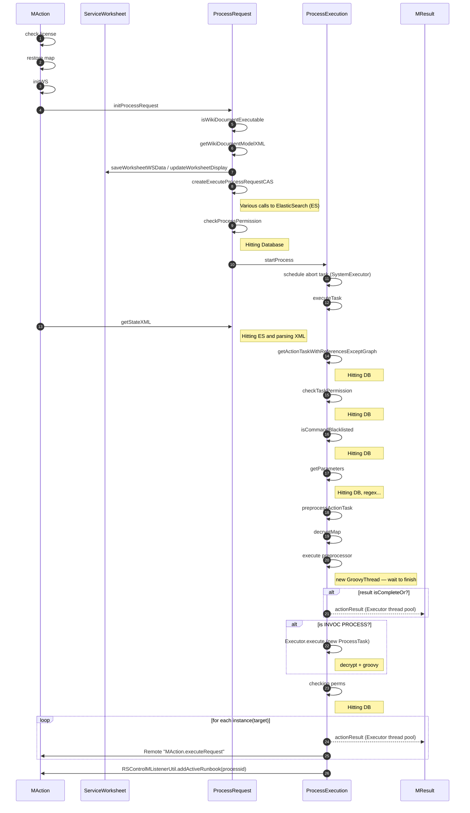

# RSControl Execution Flow (Consolidated)

This single Markdown file contains the **images** from the original PDF and PNG, plus an equivalent **Mermaid sequence diagram** of the `executeProcess` flow.

---

## Diagrams (Images)

### Execution Flow — PDF Page 1

### Thread Pools & Supporting Threads — PDF Page 2

### `executeProcess` Sequence Flow (PNG)

---

## Mermaid — `executeProcess` Sequence Diagram

The chart below mirrors the same sequence as the PNG above. Paste this file into any Markdown viewer that supports Mermaid to see it rendered.

---

## Notes on Thread Model (from PDF)

RSControl uses a customized `java.util.concurrent.ScheduledThreadPoolExecutor` via `com.resolve.thread.ExecutorScheduledThreadPool`. There are three dedicated thread pools:

- **`com.resolve.thread.StartExecutor`** (default **100** threads): used by `RSControlMListenerUtil#startRunbookSchedulingThread()` to retrieve runbook execution requests that arrive via `RSControlMessageProcessor` (listener for `RSCONTROL`, used by the API/RSView for manual executions).
- **`com.resolve.thread.SystemExecutor`** (default **100** threads): system tasks like metrics collection, gateway licensing checks, Hibernate after-update handlers, health checks (ES, RabbitMQ, DB), and triggering/executing **runbook abort**.
- **`com.resolve.thread.Executor`** (default **200** threads): handles **user-related** work such as runbook and action task execution.

Additional/related threads:
- **Hibernate connection pool** (Atomikos JTA; `<component>.sql.maxpoolsize`, default **100**), spawns threads per pooled connection.
- **ElasticSearch client threads** — typically unbounded (can be limited via client configuration).
- **RabbitMQ client threads** — one **dispatcher** thread per channel.
- **Unmanaged threads** — e.g., action-task assessors running on the active RSControl node, cleanup tasks, busy-ratio checks (`RSControlMListenerUtil#busyRatioCheck()`), and DB connectivity checks (`SelfCheck#checkDBConnectivity`, scheduled at startup).

---

## High-Level Phases in `MAction#executeProcess()`

1. **Retrieve** runbook XML model from DB.  
2. **Parse & validate** the model.  
3. **Initialize** ElasticSearch: create worksheet index if needed; populate `processrequest` to mark the runbook execution.  
4. **Trigger** action task execution.  
5. **Write results**: per-task records in `executionsummary`; runbook-level summary upon completion/abort.

