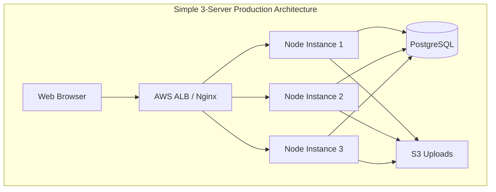

# Architecture Implementation Guide

## Current Architecture Overview

```mermaid
graph TD
    subgraph "Current Single-Instance Architecture"
        Client[Web Browser] --> Express[Express Server :5000]
        Express --> Session[In-Memory Sessions]
        Express --> Postgres[(Supabase PostgreSQL)]
        Express --> Uploads[/uploads Directory]
    end
```

## Target Simple Architecture



---

## 1. Application Structure Refactoring

### Current File Structure
```
/resolve-onboarding
├── server.js                 # Main application (2000+ lines)
├── src/
│   ├── client/              # Frontend assets
│   ├── database/            # DB connection & migrations
│   ├── middleware/          # Auth middleware
│   ├── routes/              # API routes
│   ├── utils/               # Utilities
│   └── workers/             # Background jobs
└── uploads/                 # Local file storage
```

### Recommended Modular Structure
```
/resolve-onboarding
├── server.js                # Slim entry point (~100 lines)
├── src/
│   ├── config/
│   │   ├── index.js        # Configuration loader
│   │   ├── database.js     # DB config
│   │   └── security.js     # Security settings
│   ├── middleware/
│   │   ├── auth.js         # Authentication
│   │   ├── security.js     # Helmet, CORS
│   │   ├── rateLimiter.js  # Rate limiting
│   │   └── errorHandler.js # Error handling
│   ├── services/
│   │   ├── authService.js  # Auth business logic
│   │   ├── documentService.js # Document handling
│   │   └── ragService.js   # RAG operations
│   └── routes/
│       ├── index.js        # Route aggregator
│       ├── auth.js         # Auth routes
│       ├── api.js          # API routes
│       └── admin.js        # Admin routes
```

---

## 2. Configuration Management

### Create `src/config/index.js`
```javascript
// Centralized configuration management
require('dotenv').config();

const config = {
  // Server
  port: process.env.PORT || 5000,
  nodeEnv: process.env.NODE_ENV || 'development',
  
  // Database
  database: {
    url: process.env.DATABASE_URL,
    maxConnections: parseInt(process.env.DB_MAX_CONNECTIONS || '20'),
    idleTimeout: parseInt(process.env.DB_IDLE_TIMEOUT || '30000'),
    connectionTimeout: parseInt(process.env.DB_CONNECTION_TIMEOUT || '2000'),
  },
  
  // Security
  security: {
    jwtSecret: process.env.JWT_SECRET,
    sessionSecret: process.env.SESSION_SECRET,
    bcryptRounds: parseInt(process.env.BCRYPT_ROUNDS || '10'),
    corsOrigins: process.env.CORS_ORIGINS?.split(',') || ['http://localhost:3000'],
  },
  
  // Rate Limiting
  rateLimit: {
    windowMs: parseInt(process.env.RATE_LIMIT_WINDOW || '900000'), // 15 minutes
    maxRequests: parseInt(process.env.RATE_LIMIT_MAX || '100'),
    authMaxRequests: parseInt(process.env.AUTH_RATE_LIMIT_MAX || '5'),
  },
  
  // Storage
  storage: {
    uploadDir: process.env.UPLOAD_DIR || './uploads',
    maxFileSize: parseInt(process.env.MAX_FILE_SIZE || '52428800'), // 50MB
    useS3: process.env.USE_S3 === 'true',
    s3Bucket: process.env.S3_BUCKET,
  },
  
  // Monitoring
  monitoring: {
    sentryDsn: process.env.SENTRY_DSN,
    logLevel: process.env.LOG_LEVEL || 'info',
  },
  
  // Features
  features: {
    webhooksEnabled: process.env.WEBHOOKS_ENABLED !== 'false',
    ragEnabled: process.env.RAG_ENABLED !== 'false',
  }
};

// Validate required configuration
const requiredVars = ['DATABASE_URL', 'JWT_SECRET', 'SESSION_SECRET'];
const missing = requiredVars.filter(key => !process.env[key]);

if (missing.length > 0) {
  console.error(`Missing required environment variables: ${missing.join(', ')}`);
  if (config.nodeEnv === 'production') {
    process.exit(1);
  }
}

module.exports = config;
```

---

## 3. Database Layer Refactoring

### Create `src/database/connection.js`
```javascript
const { Pool } = require('pg');
const config = require('../config');

// Create connection pool with retry logic
class DatabasePool {
  constructor() {
    this.pool = null;
    this.retryCount = 0;
    this.maxRetries = 5;
    this.retryDelay = 5000;
  }

  async connect() {
    try {
      this.pool = new Pool({
        connectionString: config.database.url,
        max: config.database.maxConnections,
        idleTimeoutMillis: config.database.idleTimeout,
        connectionTimeoutMillis: config.database.connectionTimeout,
        ssl: config.database.url.includes('supabase') 
          ? { rejectUnauthorized: false } 
          : false,
      });

      // Test connection
      await this.pool.query('SELECT 1');
      console.log('✅ Database connected successfully');
      
      // Setup error handlers
      this.pool.on('error', this.handlePoolError.bind(this));
      
      return this.pool;
    } catch (error) {
      console.error(`Database connection attempt ${this.retryCount + 1} failed:`, error.message);
      
      if (this.retryCount < this.maxRetries) {
        this.retryCount++;
        console.log(`Retrying in ${this.retryDelay / 1000} seconds...`);
        await new Promise(resolve => setTimeout(resolve, this.retryDelay));
        return this.connect();
      }
      
      throw new Error('Failed to connect to database after maximum retries');
    }
  }

  handlePoolError(err, client) {
    console.error('Unexpected database pool error:', err);
    // Don't exit the process, try to recover
  }

  async query(text, params) {
    if (!this.pool) {
      await this.connect();
    }
    
    try {
      const start = Date.now();
      const result = await this.pool.query(text, params);
      const duration = Date.now() - start;
      
      // Log slow queries in development
      if (config.nodeEnv === 'development' && duration > 1000) {
        console.log('Slow query detected:', { text, duration, rows: result.rowCount });
      }
      
      return result;
    } catch (error) {
      console.error('Query error:', error);
      throw error;
    }
  }

  async transaction(callback) {
    const client = await this.pool.connect();
    try {
      await client.query('BEGIN');
      const result = await callback(client);
      await client.query('COMMIT');
      return result;
    } catch (error) {
      await client.query('ROLLBACK');
      throw error;
    } finally {
      client.release();
    }
  }

  async close() {
    if (this.pool) {
      await this.pool.end();
    }
  }
}

module.exports = new DatabasePool();
```

---

## 4. Authentication Service Layer

### Create `src/services/authService.js`
```javascript
const bcrypt = require('bcrypt');
const crypto = require('crypto');
const db = require('../database/connection');
const config = require('../config');

class AuthService {
  constructor() {
    this.sessions = new Map(); // Will be replaced with Redis
    this.sessionTimeout = 24 * 60 * 60 * 1000; // 24 hours
    this.startSessionCleanup();
  }

  // Password hashing
  async hashPassword(password) {
    return bcrypt.hash(password, config.security.bcryptRounds);
  }

  async verifyPassword(password, hash) {
    return bcrypt.compare(password, hash);
  }

  // User management
  async createUser(userData) {
    const { email, password, company_name, phone, tier } = userData;
    
    // Check if user exists
    const existing = await db.query(
      'SELECT id FROM users WHERE email = $1',
      [email]
    );
    
    if (existing.rows.length > 0) {
      throw new Error('User already exists');
    }

    // Hash password
    const hashedPassword = await this.hashPassword(password);
    
    // Create user with transaction
    return db.transaction(async (client) => {
      const result = await client.query(
        `INSERT INTO users (email, password, company_name, phone, tier, tenant_id) 
         VALUES ($1, $2, $3, $4, $5, gen_random_uuid()) 
         RETURNING id, email, tenant_id`,
        [email, hashedPassword, company_name, phone, tier || 'standard']
      );
      
      // Create initial settings
      await client.query(
        `INSERT INTO user_settings (user_id, settings) 
         VALUES ($1, $2)`,
        [result.rows[0].id, JSON.stringify({ notifications: true })]
      );
      
      return result.rows[0];
    });
  }

  async authenticateUser(email, password) {
    const result = await db.query(
      'SELECT id, email, password, tenant_id, tier FROM users WHERE email = $1',
      [email]
    );
    
    if (result.rows.length === 0) {
      throw new Error('Invalid credentials');
    }
    
    const user = result.rows[0];
    const validPassword = await this.verifyPassword(password, user.password);
    
    if (!validPassword) {
      throw new Error('Invalid credentials');
    }
    
    // Don't return password hash
    delete user.password;
    return user;
  }

  // Session management
  generateSessionToken() {
    return crypto.randomBytes(32).toString('hex');
  }

  createSession(user) {
    const token = this.generateSessionToken();
    const session = {
      userId: user.id,
      email: user.email,
      tenantId: user.tenant_id,
      tier: user.tier,
      createdAt: Date.now(),
      expiresAt: Date.now() + this.sessionTimeout,
    };
    
    this.sessions.set(token, session);
    return { token, session };
  }

  getSession(token) {
    const session = this.sessions.get(token);
    
    if (!session) {
      return null;
    }
    
    if (session.expiresAt < Date.now()) {
      this.sessions.delete(token);
      return null;
    }
    
    // Extend session on activity
    session.expiresAt = Date.now() + this.sessionTimeout;
    return session;
  }

  destroySession(token) {
    return this.sessions.delete(token);
  }

  // Session cleanup
  startSessionCleanup() {
    setInterval(() => {
      const now = Date.now();
      for (const [token, session] of this.sessions.entries()) {
        if (session.expiresAt < now) {
          this.sessions.delete(token);
        }
      }
    }, 60 * 60 * 1000); // Every hour
  }

  // Password reset
  async generatePasswordResetToken(email) {
    const user = await db.query(
      'SELECT id FROM users WHERE email = $1',
      [email]
    );
    
    if (user.rows.length === 0) {
      // Don't reveal if user exists
      return null;
    }
    
    const token = crypto.randomBytes(32).toString('hex');
    const expires = new Date(Date.now() + 3600000); // 1 hour
    
    await db.query(
      `INSERT INTO password_resets (user_id, token, expires_at) 
       VALUES ($1, $2, $3)`,
      [user.rows[0].id, token, expires]
    );
    
    return token;
  }

  async resetPassword(token, newPassword) {
    const result = await db.query(
      `SELECT user_id FROM password_resets 
       WHERE token = $1 AND expires_at > NOW()`,
      [token]
    );
    
    if (result.rows.length === 0) {
      throw new Error('Invalid or expired reset token');
    }
    
    const hashedPassword = await this.hashPassword(newPassword);
    
    await db.transaction(async (client) => {
      // Update password
      await client.query(
        'UPDATE users SET password = $1 WHERE id = $2',
        [hashedPassword, result.rows[0].user_id]
      );
      
      // Delete reset token
      await client.query(
        'DELETE FROM password_resets WHERE token = $1',
        [token]
      );
    });
    
    return true;
  }
}

module.exports = new AuthService();
```

---

## 5. Middleware Architecture

### Create `src/middleware/security.js`
```javascript
const helmet = require('helmet');
const cors = require('cors');
const config = require('../config');

function setupSecurity(app) {
  // Helmet for security headers
  app.use(helmet({
    contentSecurityPolicy: {
      directives: {
        defaultSrc: ["'self'"],
        styleSrc: ["'self'", "'unsafe-inline'", "https://fonts.googleapis.com"],
        scriptSrc: ["'self'", "'unsafe-inline'"],
        fontSrc: ["'self'", "https://fonts.gstatic.com"],
        imgSrc: ["'self'", "data:", "https:"],
        connectSrc: ["'self'"],
      },
    },
    crossOriginEmbedderPolicy: false,
  }));

  // CORS configuration
  const corsOptions = {
    origin: function (origin, callback) {
      // Allow requests with no origin (mobile apps, Postman)
      if (!origin) return callback(null, true);
      
      if (config.security.corsOrigins.includes(origin)) {
        callback(null, true);
      } else {
        callback(new Error('Not allowed by CORS'));
      }
    },
    credentials: true,
    optionsSuccessStatus: 200,
    methods: ['GET', 'POST', 'PUT', 'DELETE', 'OPTIONS'],
    allowedHeaders: ['Content-Type', 'Authorization', 'X-Requested-With'],
  };

  app.use(cors(corsOptions));

  // Additional security headers
  app.use((req, res, next) => {
    res.setHeader('X-Content-Type-Options', 'nosniff');
    res.setHeader('X-Frame-Options', 'DENY');
    res.setHeader('X-XSS-Protection', '1; mode=block');
    res.setHeader('Referrer-Policy', 'strict-origin-when-cross-origin');
    
    // Remove powered by header
    res.removeHeader('X-Powered-By');
    
    next();
  });
}

module.exports = setupSecurity;
```

### Create `src/middleware/rateLimiter.js`
```javascript
const rateLimit = require('express-rate-limit');
const config = require('../config');

// Store for distributed rate limiting (will use Redis later)
const store = new Map();

// General API rate limiter
const apiLimiter = rateLimit({
  windowMs: config.rateLimit.windowMs,
  max: config.rateLimit.maxRequests,
  message: 'Too many requests from this IP, please try again later.',
  standardHeaders: true,
  legacyHeaders: false,
  handler: (req, res) => {
    res.status(429).json({
      error: 'Too many requests',
      retryAfter: Math.round(config.rateLimit.windowMs / 1000),
    });
  },
});

// Strict auth rate limiter
const authLimiter = rateLimit({
  windowMs: config.rateLimit.windowMs,
  max: config.rateLimit.authMaxRequests,
  message: 'Too many authentication attempts.',
  skipSuccessfulRequests: true,
  standardHeaders: true,
  legacyHeaders: false,
});

// Upload rate limiter
const uploadLimiter = rateLimit({
  windowMs: 60 * 60 * 1000, // 1 hour
  max: 10,
  message: 'Upload limit exceeded.',
});

// Per-tenant rate limiter
function tenantLimiter(maxRequests = 100) {
  return (req, res, next) => {
    if (!req.session?.tenantId) {
      return next();
    }

    const key = `tenant:${req.session.tenantId}`;
    const now = Date.now();
    const windowStart = now - config.rateLimit.windowMs;

    if (!store.has(key)) {
      store.set(key, []);
    }

    const requests = store.get(key).filter(time => time > windowStart);
    
    if (requests.length >= maxRequests) {
      return res.status(429).json({
        error: 'Tenant rate limit exceeded',
        retryAfter: Math.round((requests[0] + config.rateLimit.windowMs - now) / 1000),
      });
    }

    requests.push(now);
    store.set(key, requests);
    next();
  };
}

module.exports = {
  apiLimiter,
  authLimiter,
  uploadLimiter,
  tenantLimiter,
};
```

### Create `src/middleware/auth.js`
```javascript
const authService = require('../services/authService');

function authenticate(req, res, next) {
  // Check multiple auth methods
  let token = null;

  // 1. Check cookie
  if (req.cookies?.sessionToken) {
    token = req.cookies.sessionToken;
  }
  
  // 2. Check Authorization header
  if (!token && req.headers.authorization) {
    const bearer = req.headers.authorization.split(' ');
    if (bearer[0] === 'Bearer' && bearer[1]) {
      token = bearer[1];
    }
  }
  
  // 3. Check custom header
  if (!token && req.headers['x-session-token']) {
    token = req.headers['x-session-token'];
  }

  if (!token) {
    return res.status(401).json({ error: 'Authentication required' });
  }

  const session = authService.getSession(token);
  
  if (!session) {
    return res.status(401).json({ error: 'Invalid or expired session' });
  }

  // Add session to request
  req.session = session;
  req.userId = session.userId;
  req.tenantId = session.tenantId;
  
  next();
}

function requireAdmin(req, res, next) {
  if (!req.session) {
    return res.status(401).json({ error: 'Authentication required' });
  }

  if (req.session.tier !== 'admin') {
    return res.status(403).json({ error: 'Admin access required' });
  }

  next();
}

function optionalAuth(req, res, next) {
  // Same as authenticate but doesn't fail if no token
  let token = req.cookies?.sessionToken || 
              req.headers.authorization?.split(' ')[1] ||
              req.headers['x-session-token'];

  if (token) {
    const session = authService.getSession(token);
    if (session) {
      req.session = session;
      req.userId = session.userId;
      req.tenantId = session.tenantId;
    }
  }

  next();
}

module.exports = {
  authenticate,
  requireAdmin,
  optionalAuth,
};
```

---

## 6. Route Organization

### Create `src/routes/auth.js`
```javascript
const express = require('express');
const router = express.Router();
const authService = require('../services/authService');
const { authLimiter } = require('../middleware/rateLimiter');
const { body, validationResult } = require('express-validator');

// Validation middleware
const validateSignup = [
  body('email').isEmail().normalizeEmail(),
  body('password').isLength({ min: 8 }).withMessage('Password must be at least 8 characters'),
  body('company_name').optional().trim(),
  body('phone').optional().trim(),
];

const validateSignin = [
  body('email').isEmail().normalizeEmail(),
  body('password').notEmpty(),
];

// Signup endpoint
router.post('/signup', authLimiter, validateSignup, async (req, res) => {
  try {
    const errors = validationResult(req);
    if (!errors.isEmpty()) {
      return res.status(400).json({ errors: errors.array() });
    }

    const user = await authService.createUser(req.body);
    const { token, session } = authService.createSession(user);

    res.cookie('sessionToken', token, {
      httpOnly: true,
      secure: process.env.NODE_ENV === 'production',
      sameSite: 'strict',
      maxAge: 24 * 60 * 60 * 1000,
    });

    res.json({
      message: 'Signup successful',
      user: {
        id: user.id,
        email: user.email,
        tenantId: user.tenant_id,
      },
    });
  } catch (error) {
    console.error('Signup error:', error);
    
    if (error.message === 'User already exists') {
      return res.status(409).json({ error: 'Email already registered' });
    }
    
    res.status(500).json({ error: 'Signup failed' });
  }
});

// Signin endpoint
router.post('/signin', authLimiter, validateSignin, async (req, res) => {
  try {
    const errors = validationResult(req);
    if (!errors.isEmpty()) {
      return res.status(400).json({ errors: errors.array() });
    }

    const user = await authService.authenticateUser(req.body.email, req.body.password);
    const { token, session } = authService.createSession(user);

    res.cookie('sessionToken', token, {
      httpOnly: true,
      secure: process.env.NODE_ENV === 'production',
      sameSite: 'strict',
      maxAge: 24 * 60 * 60 * 1000,
    });

    res.json({
      message: 'Signin successful',
      user: {
        id: user.id,
        email: user.email,
        tenantId: user.tenant_id,
      },
    });
  } catch (error) {
    console.error('Signin error:', error);
    res.status(401).json({ error: 'Invalid credentials' });
  }
});

// Signout endpoint
router.post('/signout', (req, res) => {
  const token = req.cookies?.sessionToken;
  
  if (token) {
    authService.destroySession(token);
  }

  res.clearCookie('sessionToken');
  res.json({ message: 'Signout successful' });
});

// Password reset request
router.post('/forgot-password', authLimiter, async (req, res) => {
  try {
    const { email } = req.body;
    const token = await authService.generatePasswordResetToken(email);
    
    // In production, send email with reset link
    // For now, just return success (don't reveal if user exists)
    res.json({ message: 'If the email exists, a reset link has been sent' });
  } catch (error) {
    console.error('Password reset error:', error);
    res.status(500).json({ error: 'Password reset failed' });
  }
});

// Password reset
router.post('/reset-password', authLimiter, async (req, res) => {
  try {
    const { token, password } = req.body;
    
    if (!password || password.length < 8) {
      return res.status(400).json({ error: 'Password must be at least 8 characters' });
    }

    await authService.resetPassword(token, password);
    res.json({ message: 'Password reset successful' });
  } catch (error) {
    console.error('Password reset error:', error);
    res.status(400).json({ error: 'Invalid or expired reset token' });
  }
});

module.exports = router;
```

---

## 7. Refactored Server Entry Point

### Create new `server.js`
```javascript
const express = require('express');
const cookieParser = require('cookie-parser');
const compression = require('compression');
const path = require('path');

// Load configuration
const config = require('./src/config');
const db = require('./src/database/connection');

// Import middleware
const setupSecurity = require('./src/middleware/security');
const { apiLimiter } = require('./src/middleware/rateLimiter');
const { authenticate, optionalAuth } = require('./src/middleware/auth');

// Import routes
const authRoutes = require('./src/routes/auth');
const apiRoutes = require('./src/routes/api');
const adminRoutes = require('./src/routes/admin');

// Import services
const { initErrorTracking, errorHandler } = require('./src/services/errorTracking');

// Create Express app
const app = express();

// Initialize error tracking (Sentry)
if (config.monitoring.sentryDsn) {
  initErrorTracking(app);
}

// Basic middleware
app.use(compression());
app.use(express.json({ limit: '10mb' }));
app.use(express.urlencoded({ extended: true }));
app.use(cookieParser());

// Security middleware
setupSecurity(app);

// Static files with caching
app.use('/static', express.static(path.join(__dirname, 'public'), {
  maxAge: config.nodeEnv === 'production' ? '1y' : 0,
  etag: true,
  lastModified: true,
}));

// Health check endpoint (no auth required)
app.get('/health', async (req, res) => {
  try {
    // Check database connection
    await db.query('SELECT 1');
    
    res.json({
      status: 'healthy',
      timestamp: new Date().toISOString(),
      uptime: process.uptime(),
      environment: config.nodeEnv,
      version: process.env.npm_package_version || '1.0.0',
    });
  } catch (error) {
    res.status(503).json({
      status: 'unhealthy',
      error: 'Database connection failed',
      timestamp: new Date().toISOString(),
    });
  }
});

// Apply rate limiting to all API routes
app.use('/api', apiLimiter);

// Authentication routes (no auth required)
app.use('/auth', authRoutes);

// API routes (auth required)
app.use('/api', authenticate, apiRoutes);

// Admin routes (admin auth required)
app.use('/admin', authenticate, adminRoutes);

// Protected pages
app.get('/dashboard', authenticate, (req, res) => {
  res.sendFile(path.join(__dirname, 'src/client/pages/dashboard.html'));
});

// Public pages
app.get('/', (req, res) => {
  res.sendFile(path.join(__dirname, 'src/client/pages/index.html'));
});

// 404 handler
app.use((req, res) => {
  res.status(404).json({ error: 'Not found' });
});

// Error handler (must be last)
if (config.monitoring.sentryDsn) {
  app.use(errorHandler());
}

// Generic error handler
app.use((err, req, res, next) => {
  console.error('Unhandled error:', err);
  
  // Don't leak error details in production
  if (config.nodeEnv === 'production') {
    res.status(500).json({ error: 'Internal server error' });
  } else {
    res.status(500).json({
      error: err.message,
      stack: err.stack,
    });
  }
});

// Start server
async function startServer() {
  try {
    // Connect to database
    await db.connect();
    
    // Run migrations
    if (config.nodeEnv === 'production') {
      const { runMigrations } = require('./src/database/migrations');
      await runMigrations(db.pool);
    }
    
    // Start listening
    const server = app.listen(config.port, () => {
      console.log(`
╔════════════════════════════════════════╗
║   Resolve Onboarding Server Started    ║
╠════════════════════════════════════════╣
║ Environment: ${config.nodeEnv.padEnd(26)}║
║ Port: ${String(config.port).padEnd(33)}║
║ Database: Connected                    ║
║ Security: ${config.security.corsOrigins.length > 0 ? 'Configured' : 'Warning: No CORS'.padEnd(29)}║
╚════════════════════════════════════════╝
      `);
    });

    // Graceful shutdown
    process.on('SIGTERM', async () => {
      console.log('SIGTERM received, shutting down gracefully...');
      
      server.close(() => {
        console.log('HTTP server closed');
      });
      
      await db.close();
      console.log('Database connections closed');
      
      process.exit(0);
    });

  } catch (error) {
    console.error('Failed to start server:', error);
    process.exit(1);
  }
}

// Start the server
startServer();
```

---

## 8. PM2 Configuration

### Create `ecosystem.config.js`
```javascript
module.exports = {
  apps: [{
    // Application configuration
    name: 'resolve-app',
    script: './server.js',
    
    // Cluster mode for production
    instances: process.env.NODE_ENV === 'production' ? 'max' : 1,
    exec_mode: process.env.NODE_ENV === 'production' ? 'cluster' : 'fork',
    
    // Memory management
    max_memory_restart: '1G',
    
    // Environment variables
    env: {
      NODE_ENV: 'development',
      PORT: 5000,
    },
    env_production: {
      NODE_ENV: 'production',
      PORT: 5000,
    },
    
    // Logging
    error_file: './logs/pm2-error.log',
    out_file: './logs/pm2-out.log',
    log_file: './logs/pm2-combined.log',
    time: true,
    merge_logs: true,
    log_date_format: 'YYYY-MM-DD HH:mm:ss Z',
    
    // Watch & restart
    watch: false,
    autorestart: true,
    
    // Advanced features
    min_uptime: '10s',
    listen_timeout: 3000,
    kill_timeout: 5000,
    
    // Zero-downtime reload
    wait_ready: true,
    
    // Health check
    health_check: {
      interval: 30,
      url: 'http://localhost:5000/health',
      max_consecutive_failures: 3,
    },
    
    // Post-deploy actions
    post_deploy: 'npm install --production && pm2 reload ecosystem.config.js --env production',
  }],

  // Deployment configuration
  deploy: {
    production: {
      user: 'nodejs',
      host: ['server1.example.com', 'server2.example.com', 'server3.example.com'],
      ref: 'origin/main',
      repo: 'git@github.com:your-org/resolve-onboarding.git',
      path: '/var/www/resolve-onboarding',
      'post-deploy': 'npm ci --production && pm2 reload ecosystem.config.js --env production',
      env: {
        NODE_ENV: 'production',
      },
    },
  },
};
```

---

## 9. Docker Configuration Updates

### Updated `Dockerfile`
```dockerfile
# Multi-stage build for production optimization
FROM node:18-alpine AS base

# Install dependencies needed for building
RUN apk add --no-cache python3 make g++

WORKDIR /app

# Copy package files
COPY package*.json ./

# Production build stage
FROM base AS production-deps
RUN npm ci --only=production

# Development build stage
FROM base AS dev-deps
RUN npm ci

# Build stage (if you have any build steps)
FROM dev-deps AS build
COPY . .
# Add any build commands here
# RUN npm run build

# Production runtime stage
FROM node:18-alpine AS production

# Create non-root user
RUN addgroup -g 1001 -S nodejs && \
    adduser -S nodejs -u 1001

WORKDIR /app

# Copy production dependencies
COPY --from=production-deps --chown=nodejs:nodejs /app/node_modules ./node_modules

# Copy application code
COPY --chown=nodejs:nodejs . .

# Create necessary directories
RUN mkdir -p logs uploads && \
    chown -R nodejs:nodejs logs uploads

# Switch to non-root user
USER nodejs

# Expose port
EXPOSE 5000

# Health check
HEALTHCHECK --interval=30s --timeout=3s --start-period=5s --retries=3 \
  CMD node -e "require('http').get('http://localhost:5000/health', (res) => { process.exit(res.statusCode === 200 ? 0 : 1); })"

# Use PM2 for production
CMD ["npx", "pm2-runtime", "start", "ecosystem.config.js", "--env", "production"]

# Development stage
FROM dev-deps AS development

WORKDIR /app

COPY . .

EXPOSE 5000

CMD ["npm", "run", "dev"]
```

---

## 10. Migration Script for Existing Data

### Create `scripts/migrate-to-production.js`
```javascript
#!/usr/bin/env node

const bcrypt = require('bcrypt');
const { Pool } = require('pg');
require('dotenv').config();

async function migratePasswords() {
  const pool = new Pool({
    connectionString: process.env.DATABASE_URL,
  });

  try {
    console.log('Starting password migration...');
    
    // Get all users with plaintext passwords
    const users = await pool.query(
      `SELECT id, email, password FROM users 
       WHERE password NOT LIKE '$2b$%'` // Not already hashed
    );
    
    console.log(`Found ${users.rows.length} users to migrate`);
    
    // Hash each password
    for (const user of users.rows) {
      const hashedPassword = await bcrypt.hash(user.password, 10);
      
      await pool.query(
        'UPDATE users SET password = $1 WHERE id = $2',
        [hashedPassword, user.id]
      );
      
      console.log(`✓ Migrated user: ${user.email}`);
    }
    
    console.log('Password migration complete!');
    
    // Add missing indexes
    console.log('Adding performance indexes...');
    
    const indexes = [
      'CREATE INDEX IF NOT EXISTS idx_users_email ON users(email)',
      'CREATE INDEX IF NOT EXISTS idx_users_tenant ON users(tenant_id)',
      'CREATE INDEX IF NOT EXISTS idx_sessions_token ON sessions(token)',
      'CREATE INDEX IF NOT EXISTS idx_sessions_expires ON sessions(expires_at)',
      'CREATE INDEX IF NOT EXISTS idx_documents_tenant ON documents(tenant_id)',
    ];
    
    for (const index of indexes) {
      await pool.query(index);
      console.log(`✓ ${index.split(' ')[5]}`);
    }
    
    console.log('Migration complete!');
    
  } catch (error) {
    console.error('Migration failed:', error);
    process.exit(1);
  } finally {
    await pool.end();
  }
}

// Run migration
migratePasswords();
```

---

## Implementation Checklist

### Phase 1: Core Refactoring (Week 1)
- [ ] Create new directory structure
- [ ] Implement configuration management
- [ ] Create database connection layer
- [ ] Build authentication service
- [ ] Implement security middleware
- [ ] Create route organization

### Phase 2: Security Implementation (Week 2)
- [ ] Add password hashing
- [ ] Remove hardcoded secrets
- [ ] Implement rate limiting
- [ ] Add security headers
- [ ] Set up CORS properly

### Phase 3: Production Setup (Week 3)
- [ ] Configure PM2
- [ ] Update Docker configuration
- [ ] Run migration scripts
- [ ] Deploy to 3 servers
- [ ] Configure load balancer

### Testing Checklist
- [ ] Unit tests for auth service
- [ ] Integration tests for routes
- [ ] Load testing with Artillery
- [ ] Security testing with OWASP ZAP
- [ ] E2E tests with Playwright

This architecture provides a clean, maintainable, and scalable foundation for your application while keeping things simple and effective.