# Resolve Onboarding Application - Data Flow Guide

## Overview

This document provides a comprehensive guide to understanding how data flows through the Resolve Onboarding application, where it's stored, and how it's used across different systems. The application consists of multiple interconnected systems that work together to provide user management, knowledge base functionality, and AI-powered chat capabilities.

## System Architecture Overview

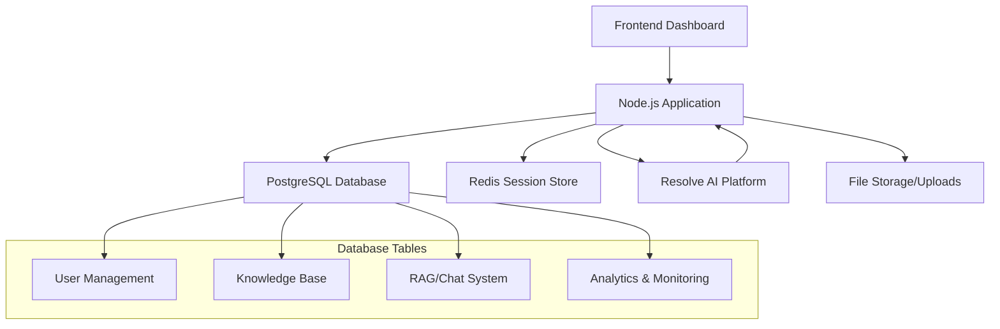

## Core Data Systems

### 1. User Management System
### 2. Knowledge Base System  
### 3. RAG Chat System
### 4. Analytics & Monitoring System

---

## 1. User Management Data Flow

### **Tables Involved:**
- `users` - Core user information
- `sessions` - Authentication tokens
- `tenant_invitations` - Multi-tenant user invitations
- `password_reset_tokens` - Password reset workflow

### **Data Flow: User Registration**

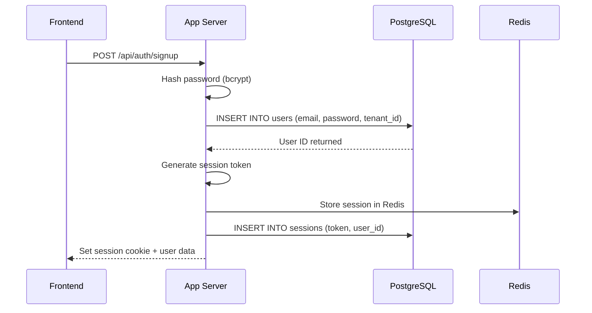

**Data Stored:**
```sql
-- users table
{
    id: 123,
    email: "user@company.com",
    password: "$2b$10$...", -- Hashed with bcrypt
    full_name: "John Doe",
    company_name: "Acme Corp",
    tenant_id: "550e8400-e29b-41d4-a716-446655440000",
    role: "user", -- or "tenant-admin"
    status: "active",
    created_at: "2024-01-15T10:30:00Z"
}

-- sessions table
{
    token: "abc123...",
    user_id: 123,
    expires_at: "2024-01-16T10:30:00Z"
}
```

**Usage Locations:**
- **Signup Flow**: `src/routes/auth.js` - Creates user and session
- **Login Flow**: `src/routes/auth.js` - Validates credentials, creates session
- **Dashboard**: `src/client/pages/dashboard.html` - Displays user info
- **Admin Panel**: `src/routes/admin.js` - User management operations

### **Data Flow: Multi-Tenant User Invitation**

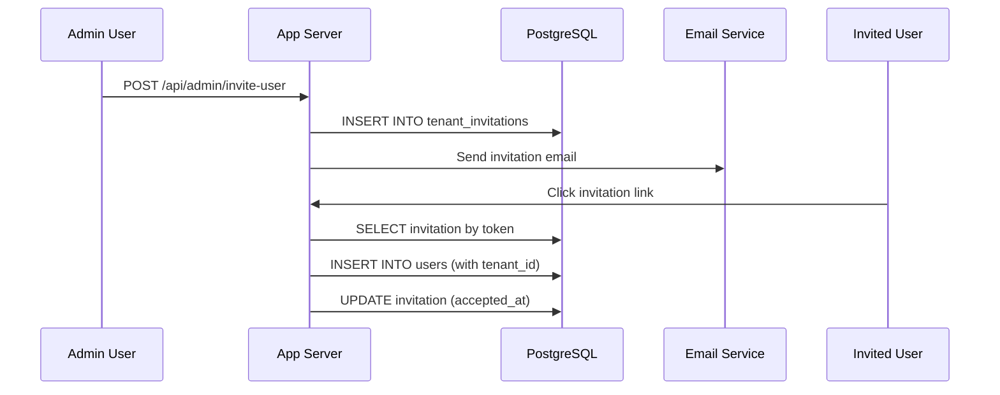

---

## 2. Knowledge Base Data Flow

### **Tables Involved:**
- `tickets` - Knowledge base articles and support tickets
- `integrations` - Data source configurations

### **Data Flow: CSV Knowledge Import**

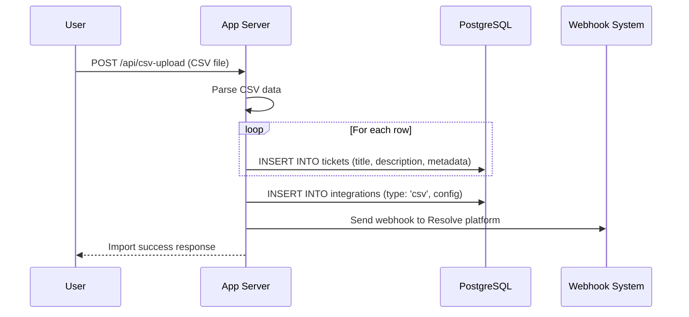

**Data Stored:**
```sql
-- tickets table (Knowledge Base Articles)
{
    id: 456,
    user_id: 123,
    external_id: "KB-001",
    title: "How to Reset Password",
    description: "Step-by-step guide for password reset...",
    status: "published",
    priority: "medium",
    metadata: {
        "category": "authentication",
        "tags": ["password", "security"],
        "import_source": "csv",
        "file_name": "kb_articles.csv"
    }
}

-- integrations table
{
    id: 789,
    user_id: 123,
    type: "csv",
    config: {
        "file_name": "kb_articles.csv",
        "import_date": "2024-01-15",
        "total_rows": 150
    },
    enabled: true
}
```

**Usage Locations:**
- **CSV Import**: `src/routes/api.js` - Processes uploaded CSV files
- **Knowledge Display**: Dashboard sidebar shows recent articles
- **Search**: Used as source material for RAG vector search
- **Admin Analytics**: `src/routes/admin.js` - Counts tickets per user

### **Data Flow: Knowledge Base API Access**

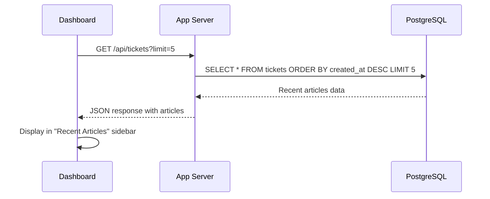

---

## 3. RAG Chat System Data Flow

### **Tables Involved:**
- `rag_documents` - Raw document storage
- `rag_vectors` - Vector embeddings for search
- `rag_conversations` - Chat conversation tracking
- `rag_messages` - Individual chat messages
- `rag_tenant_tokens` - Secure callback authentication

### **Data Flow: Document Upload & Processing**

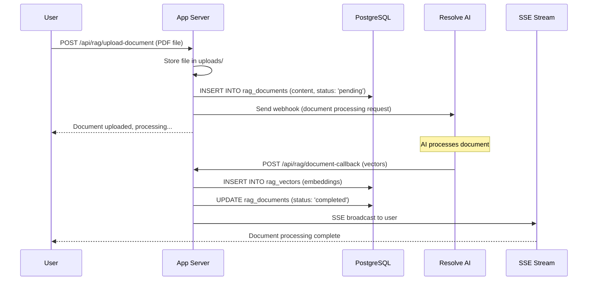

**Data Stored:**
```sql
-- rag_documents table
{
    id: 101,
    tenant_id: "550e8400-e29b-41d4-a716-446655440000",
    document_id: "doc-uuid-123",
    callback_id: "callback-abc123",
    content: "This is the full text content of the uploaded PDF...",
    metadata: {
        "original_filename": "company_policy.pdf",
        "file_size": 2048576,
        "file_type": "pdf",
        "upload_user": "user@company.com"
    },
    status: "completed",
    created_by: "user@company.com"
}

-- rag_vectors table (Vector Embeddings)
{
    id: 201,
    tenant_id: "550e8400-e29b-41d4-a716-446655440000",
    document_id: "doc-uuid-123",
    chunk_text: "Employee vacation policy allows for 15 days...",
    embedding: [0.1, -0.2, 0.8, ...], -- 1536-dimensional vector
    chunk_index: 0,
    metadata: {
        "chunk_type": "paragraph",
        "source_page": 1
    }
}
```

### **Data Flow: Chat Conversation**

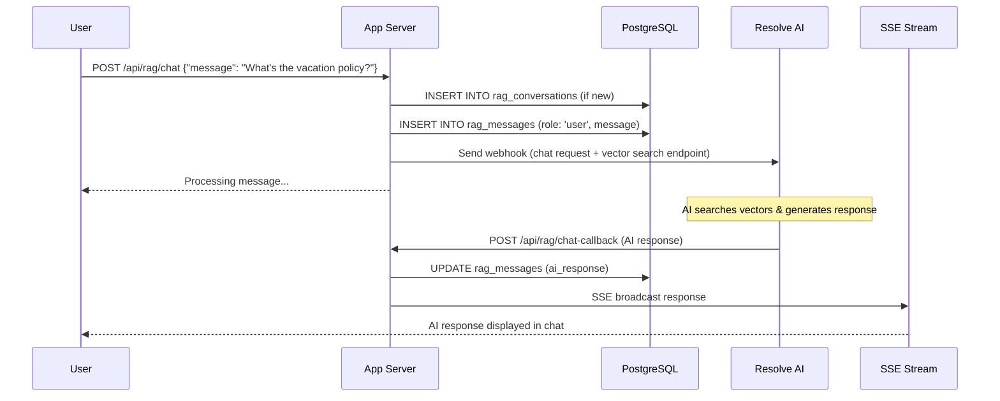

**Data Stored:**
```sql
-- rag_conversations table
{
    id: 301,
    conversation_id: "conv-uuid-456",
    tenant_id: "550e8400-e29b-41d4-a716-446655440000",
    user_email: "user@company.com",
    status: "active",
    context: {
        "topic": "hr_policies",
        "last_activity": "2024-01-15T15:30:00Z"
    }
}

-- rag_messages table
{
    id: 401,
    conversation_id: "conv-uuid-456",
    tenant_id: "550e8400-e29b-41d4-a716-446655440000",
    role: "user",
    message: "What's the vacation policy?",
    response_time_ms: null
},
{
    id: 402,
    conversation_id: "conv-uuid-456", 
    tenant_id: "550e8400-e29b-41d4-a716-446655440000",
    role: "assistant",
    message: "Based on your company policy, employees are entitled to 15 vacation days...",
    response_time_ms: 1500
}
```

**Usage Locations:**
- **Chat Interface**: `src/client/components/quikchat-rag.js` - Real-time chat
- **Document Management**: Dashboard document upload section
- **Vector Search**: `src/routes/ragApi.js` - Similarity search operations
- **Conversation History**: Chat history management

### **Data Flow: Vector Search Operation**

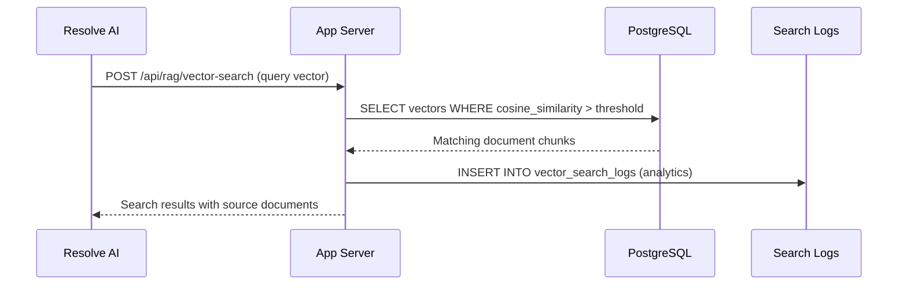

---

## 4. Analytics & Monitoring Data Flow

### **Tables Involved:**
- `workflow_triggers` - All automation events
- `admin_metrics` - Aggregated daily statistics
- `vector_search_logs` - Search operation analytics
- `webhook_traffic` - API request logging

### **Data Flow: Event Tracking**

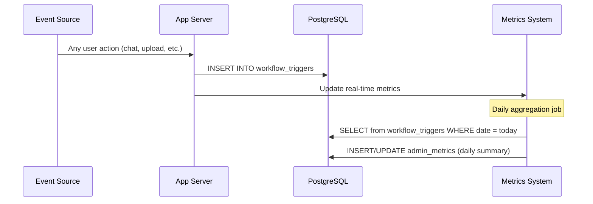

**Data Stored:**
```sql
-- workflow_triggers table
{
    id: 501,
    user_email: "user@company.com",
    trigger_type: "RAG_Chat",
    action: "send-message",
    metadata: {
        "conversation_id": "conv-uuid-456",
        "message_length": 25,
        "response_time_ms": 1500
    },
    success: true,
    triggered_at: "2024-01-15T15:30:00Z"
}

-- admin_metrics table (Daily Aggregation)
{
    id: 601,
    metric_date: "2024-01-15",
    total_triggers: 150,
    unique_users: 25,
    successful_triggers: 147,
    failed_triggers: 3,
    triggers_by_type: {
        "RAG_Chat": 85,
        "document_upload": 25,
        "csv_import": 5
    },
    triggers_by_action: {
        "send-message": 85,
        "upload-document": 25,
        "import-csv": 5
    }
}
```

**Usage Locations:**
- **Admin Dashboard**: `src/routes/admin.js` - System analytics
- **Performance Monitoring**: Response time tracking
- **Usage Analytics**: User engagement metrics

---

## Data Relationships & Dependencies

### **Primary Relationships:**

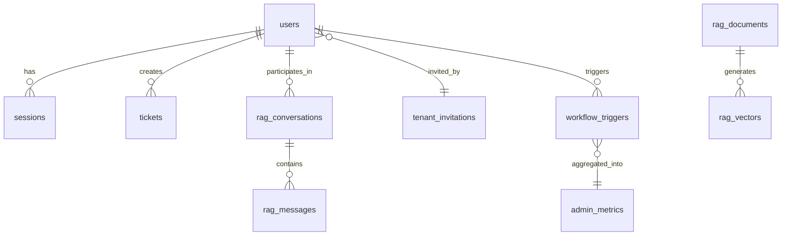

### **Tenant Isolation:**
All major tables include `tenant_id` for multi-tenant data separation:
- `users.tenant_id`
- `rag_conversations.tenant_id`
- `rag_documents.tenant_id`
- `rag_vectors.tenant_id`

### **Cross-System Integration:**
1. **Knowledge Base → RAG System**: Tickets can be vectorized for AI search
2. **User System → All Systems**: User authentication flows through all features
3. **Analytics System**: Monitors all other systems for usage patterns

---

## Error Handling & Reliability

### **Webhook Retry System:**

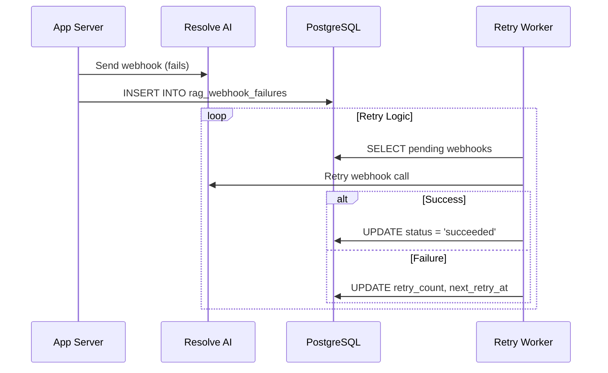

**Data Stored:**
```sql
-- rag_webhook_failures table
{
    id: 701,
    tenant_id: "550e8400-e29b-41d4-a716-446655440000",
    webhook_type: "document-processing",
    payload: {
        "document_id": "doc-uuid-123",
        "callback_url": "https://app.com/api/rag/document-callback"
    },
    retry_count: 2,
    max_retries: 3,
    next_retry_at: "2024-01-15T16:00:00Z",
    last_error: "Connection timeout",
    status: "retrying"
}
```

---

## Session & Authentication Flow

### **Session Management:**

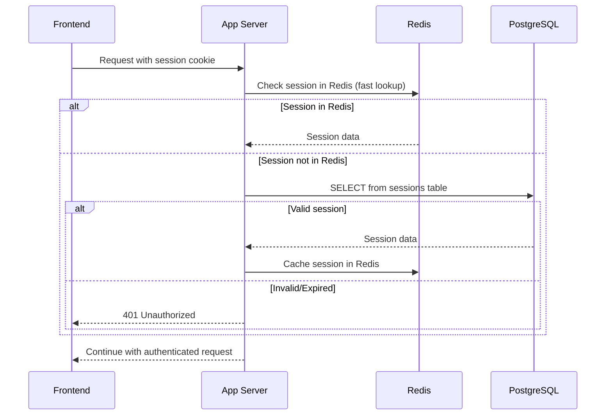

**Session Data Storage:**
- **Redis**: Fast session lookups, temporary storage
- **PostgreSQL**: Persistent session storage with expiration
- **Cookies**: Secure session tokens sent to frontend

---

## Real-Time Communication (SSE)

### **Server-Sent Events Flow:**

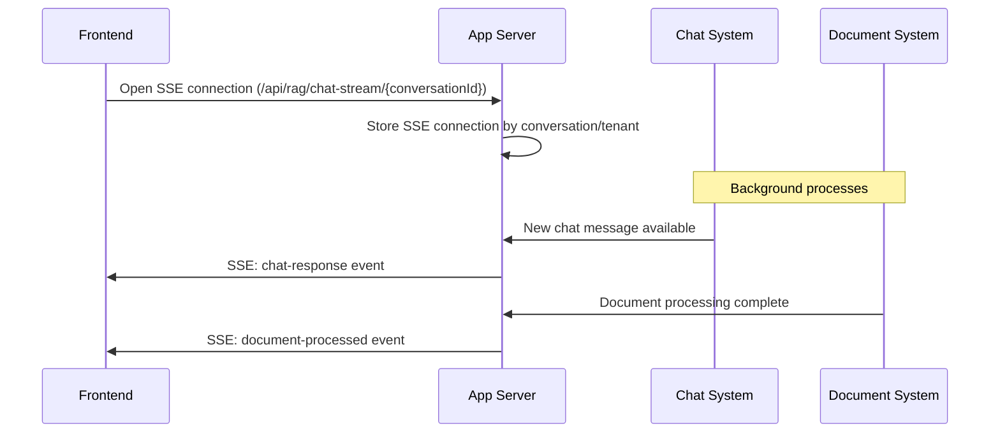

**SSE Event Types:**
- `chat-response` - AI responses to user messages
- `document-processed` - Document upload completion
- `heartbeat` - Connection keep-alive
- `error` - Error notifications

---

## File Storage & Upload Flow

### **Document Upload Process:**

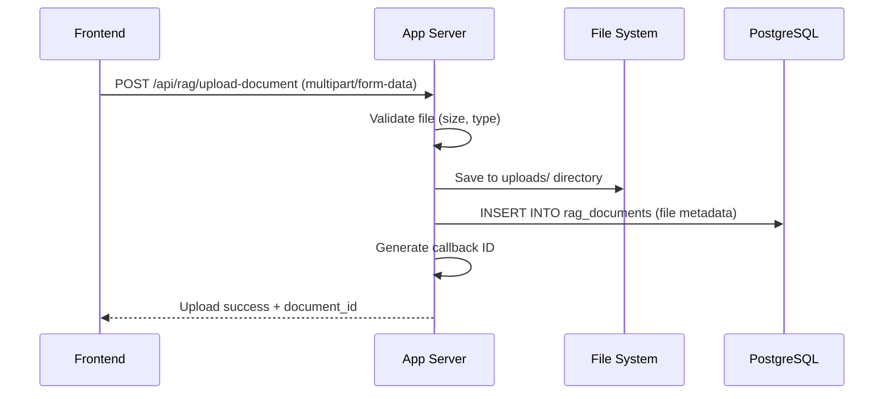

**File Storage Locations:**
- **uploads/** directory - Raw uploaded files
- **Database** - File metadata and processing status
- **Vector Database** - Processed embeddings for search

---

## Development vs Production Data Flow

### **Development Environment:**
- **Local PostgreSQL**: All data stored locally
- **Mock AI Services**: Simulated responses for testing
- **Local File Storage**: uploads/ directory in project
- **No External Dependencies**: Self-contained development

### **Production Environment:**
- **Supabase PostgreSQL**: Cloud database with pgvector
- **Resolve AI Platform**: External AI processing
- **Cloud File Storage**: Scalable file management
- **Redis Session Store**: Distributed session management

---

## Common Data Access Patterns

### **1. Tenant-Based Queries:**
```sql
-- All queries filtered by tenant for data isolation
SELECT * FROM rag_conversations WHERE tenant_id = $1;
SELECT * FROM rag_vectors WHERE tenant_id = $1 AND similarity > threshold;
```

### **2. Time-Based Analytics:**
```sql
-- Daily metrics aggregation
SELECT COUNT(*) FROM workflow_triggers 
WHERE triggered_at >= CURRENT_DATE 
AND triggered_at < CURRENT_DATE + INTERVAL '1 day';
```

### **3. Vector Similarity Search:**
```sql
-- Find similar document chunks
SELECT chunk_text, 1 - (embedding <=> $1) as similarity 
FROM rag_vectors 
WHERE tenant_id = $2 
AND 1 - (embedding <=> $1) > $3 
ORDER BY similarity DESC 
LIMIT 10;
```

### **4. Conversation History:**
```sql
-- Load chat history for conversation
SELECT role, message, created_at 
FROM rag_messages 
WHERE conversation_id = $1 
ORDER BY created_at ASC;
```

---

## Data Backup & Recovery

### **Critical Data Tables:**
1. **users** - User accounts and authentication
2. **rag_vectors** - AI embeddings (expensive to recreate)
3. **rag_conversations/messages** - Chat history
4. **rag_documents** - Original document content

### **Recovery Strategies:**
- **Database Backups**: Regular PostgreSQL dumps
- **File Backups**: uploads/ directory synchronization
- **Vector Recreation**: Can rebuild from rag_documents if needed
- **Session Recovery**: Redis data is temporary, can be recreated

---

## Performance Considerations

### **Database Indexes:**
```sql
-- Critical indexes for performance
CREATE INDEX idx_vectors_embedding ON rag_vectors USING ivfflat (embedding vector_cosine_ops);
CREATE INDEX idx_messages_conversation ON rag_messages(conversation_id);
CREATE INDEX idx_sessions_token ON sessions(token);
CREATE INDEX idx_users_tenant_id ON users(tenant_id);
```

### **Query Optimization:**
- **Vector Search**: Uses IVFFlat index for fast similarity search
- **Session Lookup**: Redis cache with PostgreSQL fallback
- **Tenant Isolation**: Indexed tenant_id on all queries
- **Time-Based Queries**: Indexed timestamps for analytics

---

## Security & Data Protection

### **Data Encryption:**
- **Passwords**: bcrypt hashed in database
- **Sessions**: Secure random tokens
- **API Callbacks**: Signed tokens for webhook security

### **Access Control:**
- **Tenant Isolation**: All queries filtered by tenant_id
- **Role-Based Access**: Admin vs user permissions
- **Session Validation**: Token-based authentication

### **Data Privacy:**
- **Personal Data**: Stored in users table with proper access controls
- **Chat History**: Tenant-isolated conversation storage
- **File Uploads**: Secure file handling and validation

This comprehensive data flow guide provides a complete understanding of how data moves through the Resolve Onboarding application, enabling developers and administrators to effectively work with the system's data architecture.