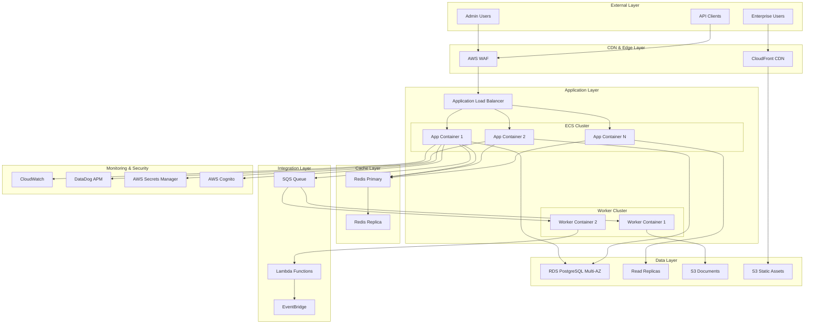

# Enterprise Architecture Blueprint for 100-Tenant Scale

## System Architecture Overview

### Target Architecture Design



---

## Component Specifications

### 1. Edge & CDN Layer

#### CloudFront Configuration
```yaml
CloudFront:
  Origins:
    - DomainName: alb.resolve.io
      OriginPath: /api
      CustomHeaders:
        - X-Origin-Verify: ${SECRET_HEADER}
    - DomainName: assets.s3.amazonaws.com
      S3OriginConfig:
        OriginAccessIdentity: ${OAI}
  
  Behaviors:
    - PathPattern: /api/*
      TargetOrigin: ALB
      ViewerProtocolPolicy: redirect-to-https
      CachingPolicy: CachingDisabled
      OriginRequestPolicy: AllViewer
    
    - PathPattern: /static/*
      TargetOrigin: S3
      ViewerProtocolPolicy: https-only
      CachingPolicy: CachingOptimized
      TTL: 86400
  
  PriceClass: PriceClass_100
  HttpVersion: http2and3
  IPV6Enabled: true
```

#### AWS WAF Rules
```yaml
WAF:
  RateLimiting:
    - Rule: RateLimitPerIP
      Limit: 2000
      Window: 5_MINUTES
      Action: BLOCK
    
  GeoBlocking:
    - Rule: AllowedCountries
      Countries: [US, CA, GB, EU]
      Action: ALLOW
    
  SQLInjection:
    - Rule: SQLiProtection
      Sensitivity: HIGH
      Action: BLOCK
    
  XSS:
    - Rule: XSSProtection
      Sensitivity: HIGH
      Action: BLOCK
```

---

### 2. Compute Layer

#### ECS Task Definition
```yaml
TaskDefinition:
  Family: resolve-app
  NetworkMode: awsvpc
  RequiresCompatibilities: [FARGATE]
  Cpu: "2048"
  Memory: "4096"
  
  ContainerDefinitions:
    - Name: resolve-app
      Image: ${ECR_IMAGE}
      Essential: true
      
      PortMappings:
        - ContainerPort: 5000
          Protocol: tcp
      
      Environment:
        - Name: NODE_ENV
          Value: production
        - Name: CLUSTER_MODE
          Value: "true"
        - Name: REDIS_CLUSTER
          Value: ${REDIS_ENDPOINT}
      
      Secrets:
        - Name: DATABASE_URL
          ValueFrom: ${SECRET_ARN}:database_url::
        - Name: JWT_SECRET
          ValueFrom: ${SECRET_ARN}:jwt_secret::
      
      HealthCheck:
        Command: ["CMD-SHELL", "curl -f http://localhost:5000/health || exit 1"]
        Interval: 30
        Timeout: 5
        Retries: 3
        StartPeriod: 60
      
      LogConfiguration:
        LogDriver: awslogs
        Options:
          awslogs-group: /ecs/resolve-app
          awslogs-region: us-east-1
          awslogs-stream-prefix: app
```

#### Auto Scaling Configuration
```yaml
AutoScaling:
  MinCapacity: 3
  MaxCapacity: 20
  
  TargetTrackingScaling:
    - MetricType: ECSServiceAverageCPUUtilization
      TargetValue: 70
      ScaleInCooldown: 300
      ScaleOutCooldown: 60
    
    - MetricType: ECSServiceAverageMemoryUtilization
      TargetValue: 80
      ScaleInCooldown: 300
      ScaleOutCooldown: 60
    
    - MetricType: ALBRequestCountPerTarget
      TargetValue: 1000
      ScaleInCooldown: 300
      ScaleOutCooldown: 60
```

---

### 3. Database Layer

#### RDS PostgreSQL Configuration
```yaml
RDS:
  Engine: postgres
  EngineVersion: "15.4"
  DBInstanceClass: db.r6g.2xlarge
  AllocatedStorage: 500
  StorageType: gp3
  Iops: 12000
  StorageEncrypted: true
  
  MultiAZ: true
  BackupRetentionPeriod: 30
  PreferredBackupWindow: "03:00-04:00"
  PreferredMaintenanceWindow: "sun:04:00-sun:05:00"
  
  PerformanceInsights:
    Enabled: true
    RetentionPeriod: 7
  
  Parameters:
    max_connections: 500
    shared_buffers: "2GB"
    effective_cache_size: "6GB"
    work_mem: "16MB"
    maintenance_work_mem: "512MB"
    wal_buffers: "16MB"
    checkpoint_completion_target: 0.9
    random_page_cost: 1.1
```

#### Database Schema Optimization
```sql
-- Partitioning for large tables
CREATE TABLE documents (
    id UUID PRIMARY KEY DEFAULT gen_random_uuid(),
    tenant_id UUID NOT NULL,
    content TEXT,
    created_at TIMESTAMP NOT NULL,
    metadata JSONB
) PARTITION BY RANGE (created_at);

-- Create monthly partitions
CREATE TABLE documents_2024_01 PARTITION OF documents
    FOR VALUES FROM ('2024-01-01') TO ('2024-02-01');

-- Optimized indexes
CREATE INDEX idx_documents_tenant_created 
    ON documents(tenant_id, created_at DESC);
CREATE INDEX idx_documents_metadata 
    ON documents USING GIN(metadata);

-- Vector search optimization
CREATE INDEX idx_embeddings_vector 
    ON embeddings USING ivfflat (embedding vector_cosine_ops)
    WITH (lists = 100);
```

---

### 4. Caching Layer

#### Redis Cluster Configuration
```yaml
RedisCluster:
  Engine: redis
  CacheNodeType: cache.r6g.xlarge
  NumCacheClusters: 2
  AutomaticFailoverEnabled: true
  
  ParameterGroup:
    maxmemory-policy: allkeys-lru
    timeout: 300
    tcp-keepalive: 60
    maxclients: 10000
  
  SecurityGroup:
    - Allow from ECS tasks
    - Deny all other traffic
```

#### Caching Strategy Implementation
```javascript
class CacheManager {
  constructor() {
    this.redis = new Redis.Cluster([
      { host: process.env.REDIS_PRIMARY, port: 6379 },
      { host: process.env.REDIS_REPLICA, port: 6379 }
    ], {
      redisOptions: {
        password: process.env.REDIS_PASSWORD,
        tls: {}
      }
    });
  }

  async get(key, options = {}) {
    const { tenant_id } = options;
    const namespaced_key = tenant_id ? `${tenant_id}:${key}` : key;
    
    const cached = await this.redis.get(namespaced_key);
    if (cached) {
      return JSON.parse(cached);
    }
    
    if (options.loader) {
      const data = await options.loader();
      await this.set(key, data, options);
      return data;
    }
    
    return null;
  }

  async set(key, value, options = {}) {
    const { tenant_id, ttl = 3600 } = options;
    const namespaced_key = tenant_id ? `${tenant_id}:${key}` : key;
    
    await this.redis.setex(
      namespaced_key,
      ttl,
      JSON.stringify(value)
    );
  }

  async invalidate(pattern, tenant_id) {
    const keys = await this.redis.keys(`${tenant_id}:${pattern}*`);
    if (keys.length) {
      await this.redis.del(...keys);
    }
  }
}
```

---

### 5. Message Queue & Background Processing

#### SQS Configuration
```yaml
Queues:
  DocumentProcessing:
    Type: FIFO
    MessageRetentionPeriod: 1209600  # 14 days
    VisibilityTimeout: 300
    RedrivePolicy:
      deadLetterTargetArn: ${DLQ_ARN}
      maxReceiveCount: 3
    
  WebhookRetry:
    Type: Standard
    DelaySeconds: 0
    MessageRetentionPeriod: 345600  # 4 days
    VisibilityTimeout: 60
```

#### Worker Implementation
```javascript
class DocumentWorker {
  constructor() {
    this.sqs = new AWS.SQS();
    this.s3 = new AWS.S3();
    this.vectorizer = new VectorizerService();
  }

  async processMessages() {
    const params = {
      QueueUrl: process.env.DOCUMENT_QUEUE_URL,
      MaxNumberOfMessages: 10,
      WaitTimeSeconds: 20
    };

    const { Messages } = await this.sqs.receiveMessage(params).promise();
    
    if (Messages) {
      await Promise.all(Messages.map(msg => this.processDocument(msg)));
    }
  }

  async processDocument(message) {
    try {
      const { documentId, tenantId, s3Key } = JSON.parse(message.Body);
      
      // Download from S3
      const document = await this.s3.getObject({
        Bucket: process.env.DOCUMENT_BUCKET,
        Key: s3Key
      }).promise();
      
      // Process and vectorize
      const vectors = await this.vectorizer.process(document.Body);
      
      // Store vectors
      await this.storeVectors(documentId, tenantId, vectors);
      
      // Delete message
      await this.sqs.deleteMessage({
        QueueUrl: process.env.DOCUMENT_QUEUE_URL,
        ReceiptHandle: message.ReceiptHandle
      }).promise();
      
    } catch (error) {
      console.error('Document processing failed:', error);
      // Message will be retried
    }
  }
}
```

---

### 6. Authentication & Authorization

#### AWS Cognito Integration
```yaml
CognitoUserPool:
  PoolName: resolve-users
  
  Policies:
    PasswordPolicy:
      MinimumLength: 12
      RequireUppercase: true
      RequireLowercase: true
      RequireNumbers: true
      RequireSymbols: true
  
  MfaConfiguration: OPTIONAL
  EnabledMfas: [SOFTWARE_TOKEN_MFA]
  
  Schema:
    - Name: email
      Required: true
      Mutable: false
    - Name: tenant_id
      AttributeDataType: String
      Mutable: false
    - Name: role
      AttributeDataType: String
      Mutable: true
  
  AccountRecoverySetting:
    RecoveryMechanisms:
      - Priority: 1
        Name: verified_email
```

#### RBAC Implementation
```javascript
class RBACMiddleware {
  constructor() {
    this.permissions = {
      admin: ['*'],
      tenant_admin: [
        'tenant:read',
        'tenant:write',
        'user:read',
        'user:write',
        'document:*',
        'integration:*'
      ],
      user: [
        'tenant:read',
        'user:read:self',
        'user:write:self',
        'document:read',
        'document:write:own'
      ],
      readonly: [
        'tenant:read',
        'user:read:self',
        'document:read'
      ]
    };
  }

  authorize(requiredPermission) {
    return async (req, res, next) => {
      const user = req.user;
      const userPermissions = this.permissions[user.role] || [];
      
      const hasPermission = userPermissions.some(perm => {
        if (perm === '*') return true;
        if (perm === requiredPermission) return true;
        
        // Check wildcard permissions
        const permParts = perm.split(':');
        const reqParts = requiredPermission.split(':');
        
        return permParts.every((part, i) => 
          part === '*' || part === reqParts[i]
        );
      });
      
      if (!hasPermission) {
        return res.status(403).json({ 
          error: 'Insufficient permissions' 
        });
      }
      
      next();
    };
  }
}
```

---

### 7. Monitoring & Observability

#### DataDog APM Configuration
```yaml
DataDog:
  ApiKey: ${DD_API_KEY}
  Site: datadoghq.com
  
  APM:
    Enabled: true
    SampleRate: 0.1
    ServiceName: resolve-app
    Env: production
    
  Logging:
    Enabled: true
    Source: nodejs
    Service: resolve-app
    
  Metrics:
    - http.request.duration
    - http.request.count
    - db.query.duration
    - cache.hit.ratio
    - document.processing.time
    
  Monitors:
    - Name: High Error Rate
      Query: "avg(last_5m):sum:errors{service:resolve-app} > 10"
      Type: metric alert
      Priority: P1
      
    - Name: Slow Response Time
      Query: "avg(last_5m):avg:http.request.duration{service:resolve-app} > 500"
      Type: metric alert
      Priority: P2
```

#### Custom Metrics Implementation
```javascript
class MetricsCollector {
  constructor() {
    this.dogstatsd = new StatsD({
      host: process.env.DD_AGENT_HOST,
      port: 8125,
      prefix: 'resolve.'
    });
  }

  recordHttpRequest(req, res, duration) {
    const tags = [
      `method:${req.method}`,
      `path:${req.route?.path || 'unknown'}`,
      `status:${res.statusCode}`,
      `tenant:${req.tenantId || 'unknown'}`
    ];
    
    this.dogstatsd.histogram('http.request.duration', duration, tags);
    this.dogstatsd.increment('http.request.count', 1, tags);
    
    if (res.statusCode >= 500) {
      this.dogstatsd.increment('http.error.5xx', 1, tags);
    } else if (res.statusCode >= 400) {
      this.dogstatsd.increment('http.error.4xx', 1, tags);
    }
  }

  recordDatabaseQuery(query, duration, success) {
    const tags = [
      `query:${query.command}`,
      `success:${success}`,
      `tenant:${query.tenantId || 'unknown'}`
    ];
    
    this.dogstatsd.histogram('db.query.duration', duration, tags);
    this.dogstatsd.increment('db.query.count', 1, tags);
  }

  recordCacheOperation(operation, hit, duration) {
    const tags = [
      `operation:${operation}`,
      `hit:${hit}`
    ];
    
    this.dogstatsd.histogram('cache.operation.duration', duration, tags);
    this.dogstatsd.increment(`cache.${hit ? 'hit' : 'miss'}`, 1, tags);
  }
}
```

---

### 8. Disaster Recovery & Business Continuity

#### Backup Strategy
```yaml
BackupPlan:
  RDS:
    AutomatedBackups:
      RetentionPeriod: 30
      BackupWindow: "03:00-04:00"
    
    Snapshots:
      Frequency: Daily
      RetentionPeriod: 90
      CrossRegionCopy: us-west-2
    
  S3:
    Versioning: Enabled
    Replication:
      Destination: us-west-2
      StorageClass: GLACIER
    
    LifecyclePolicy:
      - TransitionToIA: 30
      - TransitionToGlacier: 90
      - Delete: 365
  
  DocumentDB:
    PointInTimeRecovery: true
    ContinuousBackups: true
```

#### Disaster Recovery Procedures
```yaml
RPO: 1 hour  # Recovery Point Objective
RTO: 4 hours # Recovery Time Objective

Procedures:
  DatabaseFailure:
    1. Promote read replica to master
    2. Update application configuration
    3. Verify data consistency
    4. Resume operations
    
  RegionFailure:
    1. Activate DR environment in us-west-2
    2. Update Route53 records
    3. Restore from cross-region backups
    4. Verify service functionality
    
  DataCorruption:
    1. Identify corruption timestamp
    2. Restore from point-in-time backup
    3. Replay transaction logs
    4. Validate data integrity
```

---

### 9. Security Hardening

#### Network Security
```yaml
VPC:
  CIDR: 10.0.0.0/16
  
  Subnets:
    Public:
      - 10.0.1.0/24  # AZ-1
      - 10.0.2.0/24  # AZ-2
    
    Private:
      - 10.0.10.0/24 # AZ-1 App
      - 10.0.11.0/24 # AZ-2 App
      - 10.0.20.0/24 # AZ-1 Data
      - 10.0.21.0/24 # AZ-2 Data
  
  SecurityGroups:
    ALB:
      Ingress:
        - Port: 443, Source: 0.0.0.0/0
        - Port: 80, Source: 0.0.0.0/0
    
    App:
      Ingress:
        - Port: 5000, Source: ALB-SG
    
    Database:
      Ingress:
        - Port: 5432, Source: App-SG
    
    Cache:
      Ingress:
        - Port: 6379, Source: App-SG
```

#### Secrets Management
```javascript
class SecretsManager {
  constructor() {
    this.client = new AWS.SecretsManager();
    this.cache = new Map();
    this.ttl = 3600000; // 1 hour
  }

  async getSecret(secretName) {
    // Check cache
    const cached = this.cache.get(secretName);
    if (cached && cached.expires > Date.now()) {
      return cached.value;
    }

    try {
      const data = await this.client.getSecretValue({
        SecretId: secretName
      }).promise();
      
      const secret = JSON.parse(data.SecretString);
      
      // Cache the secret
      this.cache.set(secretName, {
        value: secret,
        expires: Date.now() + this.ttl
      });
      
      return secret;
    } catch (error) {
      console.error(`Failed to retrieve secret ${secretName}:`, error);
      throw error;
    }
  }

  async rotateSecret(secretName) {
    const newSecret = this.generateSecret();
    
    await this.client.putSecretValue({
      SecretId: secretName,
      SecretString: JSON.stringify(newSecret)
    }).promise();
    
    // Clear cache
    this.cache.delete(secretName);
    
    return newSecret;
  }
}
```

---

### 10. Performance Optimization

#### Application Optimizations
```javascript
// Connection pooling optimization
const dbPool = new Pool({
  connectionString: process.env.DATABASE_URL,
  max: 50,                    // Increased for scale
  idleTimeoutMillis: 30000,
  connectionTimeoutMillis: 5000,
  statement_timeout: 30000,
  query_timeout: 30000
});

// Query optimization with prepared statements
class OptimizedQueries {
  constructor(pool) {
    this.pool = pool;
    this.statements = new Map();
  }

  async prepare(name, text) {
    if (!this.statements.has(name)) {
      this.statements.set(name, { text, name });
    }
    return this.statements.get(name);
  }

  async execute(statementName, params) {
    const statement = this.statements.get(statementName);
    if (!statement) {
      throw new Error(`Statement ${statementName} not prepared`);
    }
    
    return this.pool.query({
      name: statement.name,
      text: statement.text,
      values: params
    });
  }
}

// Batch processing optimization
class BatchProcessor {
  constructor(batchSize = 100) {
    this.batchSize = batchSize;
    this.queue = [];
    this.processing = false;
  }

  async add(item) {
    this.queue.push(item);
    
    if (this.queue.length >= this.batchSize) {
      await this.process();
    }
  }

  async process() {
    if (this.processing || this.queue.length === 0) return;
    
    this.processing = true;
    const batch = this.queue.splice(0, this.batchSize);
    
    try {
      await this.processBatch(batch);
    } finally {
      this.processing = false;
    }
  }

  async processBatch(items) {
    // Implement batch processing logic
    const query = `
      INSERT INTO events (tenant_id, type, data, created_at)
      VALUES ${items.map((_, i) => 
        `($${i*4+1}, $${i*4+2}, $${i*4+3}, $${i*4+4})`
      ).join(',')}
    `;
    
    const values = items.flatMap(item => [
      item.tenantId,
      item.type,
      JSON.stringify(item.data),
      new Date()
    ]);
    
    await dbPool.query(query, values);
  }
}
```

---

## Implementation Timeline

### Month 1: Foundation
- Week 1-2: Security fixes and authentication upgrade
- Week 3-4: Database optimization and connection pooling

### Month 2: Infrastructure
- Week 1-2: ECS/Fargate setup and containerization
- Week 3-4: Load balancing and auto-scaling configuration

### Month 3: Performance & Monitoring
- Week 1-2: Redis caching and CDN implementation
- Week 3-4: Monitoring, logging, and alerting setup

### Month 4: Enterprise Features
- Week 1-2: Multi-tenancy enhancements and RBAC
- Week 3-4: Testing, optimization, and go-live preparation

---

## Cost Analysis

### Monthly Infrastructure Costs (100 Tenants)

```yaml
AWS Services:
  Compute:
    ECS Fargate (3-20 tasks): $300-$1,500
    Lambda functions: $50
  
  Storage:
    RDS PostgreSQL Multi-AZ: $650
    S3 (1TB storage + transfer): $150
    EBS volumes: $100
  
  Networking:
    Load Balancer: $25
    CloudFront CDN: $100
    Data Transfer: $200
  
  Caching:
    ElastiCache Redis: $140
  
  Monitoring:
    CloudWatch: $50
    DataDog APM: $300
  
  Security:
    WAF: $25
    Secrets Manager: $10
    Cognito: $50
  
  Queue:
    SQS: $20
  
Total: ~$2,170/month
Per Tenant: ~$21.70/month

With Reserved Instances (1-year):
Total: ~$1,519/month
Per Tenant: ~$15.19/month
```

---

## Success Criteria

### Technical Metrics
- **Availability:** 99.95% uptime
- **Performance:** p95 response time < 200ms
- **Scalability:** Support 10,000 concurrent users
- **Security:** Zero critical vulnerabilities
- **Compliance:** SOC 2 Type II ready

### Business Metrics
- **Tenant Onboarding:** < 5 minutes
- **Document Processing:** < 30 seconds for 10MB files
- **Support Tickets:** < 2% of users
- **Cost Efficiency:** < $25/tenant/month
- **Customer Satisfaction:** > 4.5/5 rating

---

## Risk Mitigation

### Technical Risks
1. **Database bottleneck:** Implement read replicas and caching
2. **Single point of failure:** Multi-AZ deployment with failover
3. **Data loss:** Automated backups with point-in-time recovery
4. **Security breach:** Defense in depth with WAF, encryption, and monitoring
5. **Performance degradation:** Auto-scaling and performance monitoring

### Operational Risks
1. **Deployment failures:** Blue-green deployments with rollback
2. **Configuration drift:** Infrastructure as Code (Terraform)
3. **Knowledge gaps:** Comprehensive documentation and runbooks
4. **Vendor lock-in:** Use of standard technologies where possible
5. **Cost overruns:** Reserved instances and cost monitoring

---

## Conclusion

This enterprise architecture blueprint provides a comprehensive roadmap for scaling the Resolve Onboarding platform to support 100 enterprise tenants. The architecture emphasizes:

- **Security first** approach with defense in depth
- **High availability** through multi-AZ deployment
- **Performance optimization** with caching and CDN
- **Operational excellence** through automation and monitoring
- **Cost efficiency** through reserved instances and optimization

Implementation of this architecture will transform the platform from a single-instance application to a robust, enterprise-grade solution capable of meeting the demands of 100 concurrent tenants while maintaining high performance, security, and reliability standards.