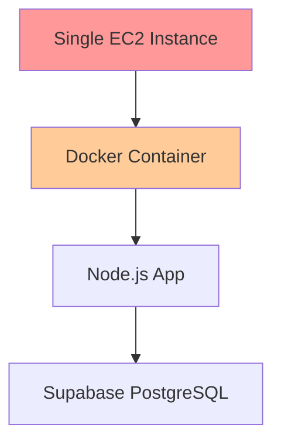
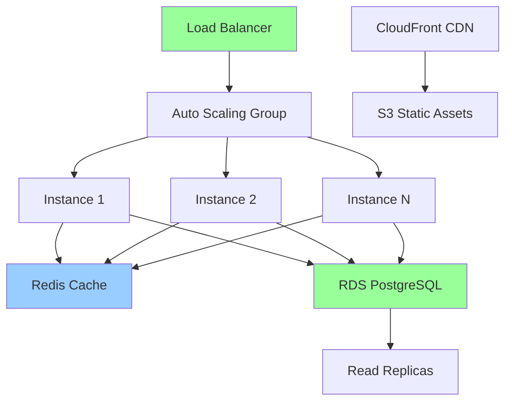

# Production Readiness Assessment for Enterprise Scale (100 Tenants)

## Executive Summary

**Current State:** The Resolve Onboarding platform is a sophisticated knowledge management and customer onboarding application with advanced RAG capabilities. However, it requires significant enhancements before supporting 100 enterprise tenants in production.

**Overall Readiness Score: 35/100**

### Critical Gaps Summary
- **Security:** Plaintext passwords, hardcoded credentials, weak authentication
- **Scalability:** Single-instance architecture, no horizontal scaling
- **Reliability:** No high availability, limited monitoring, no disaster recovery
- **Performance:** No caching, limited connection pooling, no CDN
- **Operations:** Manual deployments, no rollback capability, limited observability

---

## 1. Security Assessment

### Critical Security Issues (IMMEDIATE ACTION REQUIRED)

#### Password Security
- **CRITICAL:** Passwords stored in plaintext in database
- **Required:** Implement bcrypt hashing immediately
- **Impact:** Data breach risk, compliance violations

#### Secrets Management
- **CRITICAL:** Database credentials hardcoded in source code
- **CRITICAL:** API keys and tokens exposed in code
- **Required:** Implement secrets management (AWS Secrets Manager, HashiCorp Vault)

#### Authentication & Authorization
- **Issue:** In-memory session storage (not scalable)
- **Issue:** No JWT implementation despite JWT_SECRET being defined
- **Issue:** No multi-factor authentication (MFA)
- **Issue:** Basic role management without RBAC

#### API Security
- **Issue:** Overly permissive CORS policy (`Access-Control-Allow-Origin: *`)
- **Issue:** No CSRF protection
- **Issue:** Limited rate limiting (only on RAG endpoints)
- **Issue:** Missing security headers (CSP, HSTS, etc.)

### Security Recommendations

```yaml
Priority 1 (Immediate):
  - Implement bcrypt password hashing
  - Remove all hardcoded credentials
  - Fix CORS policy to specific origins
  - Add CSRF protection

Priority 2 (Next Sprint):
  - Implement JWT with refresh tokens
  - Add Redis-backed session storage
  - Implement comprehensive rate limiting
  - Add security headers

Priority 3 (Enterprise Features):
  - Multi-factor authentication (MFA)
  - Role-based access control (RBAC)
  - API key management system
  - Security audit logging
```

---

## 2. Database & Multi-Tenancy

### Current Implementation
- **Good:** UUID-based tenant isolation
- **Good:** Parameterized queries (SQL injection protection)
- **Good:** pgvector integration for RAG capabilities

### Critical Issues
- **Tenant Isolation:** Basic UUID validation only, no cross-tenant access prevention
- **Connection Pooling:** Limited to 10 connections (insufficient for 100 tenants)
- **No Read Replicas:** Single database instance, no failover
- **Performance:** No query optimization or indexing strategy for scale

### Database Scaling Requirements

```sql
-- Required indexes for performance
CREATE INDEX idx_documents_tenant_id ON documents(tenant_id);
CREATE INDEX idx_embeddings_tenant_document ON embeddings(tenant_id, document_id);
CREATE INDEX idx_users_tenant_email ON users(tenant_id, email);

-- Partitioning strategy for large tables
CREATE TABLE documents_2024 PARTITION OF documents
FOR VALUES FROM ('2024-01-01') TO ('2025-01-01');
```

### Recommendations
1. **Implement connection pooling** with PgBouncer (100+ connections)
2. **Add read replicas** for query distribution
3. **Implement database sharding** by tenant_id for true multi-tenancy
4. **Add caching layer** (Redis) for frequent queries
5. **Optimize vector search** with appropriate indexing

---

## 3. Infrastructure & Scalability

### Current Architecture Limitations



### Required Enterprise Architecture



### Infrastructure Requirements

#### Compute Layer
- **Current:** Single Docker container on EC2
- **Required:** 
  - ECS/EKS cluster with auto-scaling
  - Minimum 3 instances across availability zones
  - Load balancer with health checks
  - Container orchestration (Kubernetes/ECS)

#### Data Layer
- **Current:** Single Supabase PostgreSQL instance
- **Required:**
  - RDS PostgreSQL with Multi-AZ
  - Read replicas for query distribution
  - Redis cluster for caching and sessions
  - S3 for document storage (not database)

#### Monitoring & Observability
- **Current:** Basic health endpoint, console.log
- **Required:**
  - APM solution (DataDog, New Relic, AppDynamics)
  - Centralized logging (ELK Stack, CloudWatch)
  - Metrics collection (Prometheus/Grafana)
  - Distributed tracing (Jaeger, X-Ray)
  - Real-time alerting (PagerDuty, OpsGenie)

---

## 4. Performance Optimization

### Current Performance Bottlenecks
1. **No caching** - Every request hits database
2. **Synchronous processing** - No background job queue
3. **In-memory storage** - Sessions, rate limits in RAM
4. **No CDN** - Static assets served from application
5. **Limited connection pool** - Max 10 database connections

### Performance Requirements for 100 Tenants

```yaml
Target Metrics:
  - Response Time: < 200ms (p95)
  - Throughput: 10,000 requests/minute
  - Concurrent Users: 1,000+
  - Document Processing: < 30 seconds for 10MB files
  - Vector Search: < 100ms for 1M embeddings
  - Availability: 99.9% uptime
```

### Optimization Strategy

#### Application Layer
```javascript
// Implement caching strategy
const cache = new Redis({
  cluster: true,
  ttl: 3600,
  maxSize: '1GB'
});

// Use read replicas for queries
const readPool = new Pool({
  connectionString: READ_REPLICA_URL,
  max: 50
});

// Implement connection pooling
const writePool = new Pool({
  connectionString: MASTER_DB_URL,
  max: 30
});
```

#### Background Processing
```javascript
// Implement job queue with Bull
const Queue = require('bull');
const documentQueue = new Queue('document-processing', REDIS_URL);
const webhookQueue = new Queue('webhook-retry', REDIS_URL);

// Process jobs with concurrency
documentQueue.process(10, async (job) => {
  // Process documents asynchronously
});
```

---

## 5. Deployment & Operations

### Current CI/CD Pipeline Issues
- **E2E tests disabled** in GitHub Actions
- **No staging environment**
- **No rollback mechanism**
- **Manual database migrations**
- **Single deployment target**

### Required CI/CD Pipeline

```yaml
name: Enterprise Deployment Pipeline
on:
  push:
    branches: [main, staging]

jobs:
  test:
    runs-on: ubuntu-latest
    steps:
      - Unit Tests
      - Integration Tests
      - E2E Tests (Playwright)
      - Security Scanning (Snyk/OWASP)
      - Performance Tests

  build:
    needs: test
    steps:
      - Multi-architecture build
      - Container scanning
      - Push to registry

  deploy-staging:
    needs: build
    if: github.ref == 'refs/heads/staging'
    steps:
      - Blue-green deployment
      - Run migrations
      - Smoke tests
      - Performance validation

  deploy-production:
    needs: deploy-staging
    if: github.ref == 'refs/heads/main'
    steps:
      - Canary deployment (10% traffic)
      - Monitor metrics
      - Progressive rollout
      - Automatic rollback on errors
```

### Deployment Requirements
1. **Blue-Green Deployments** for zero-downtime updates
2. **Canary Releases** for gradual rollout
3. **Automated Rollback** based on error rates
4. **Database Migration Strategy** with backward compatibility
5. **Feature Flags** for controlled feature release

---

## 6. Compliance & Governance

### Current Compliance Gaps
- **No data encryption** at rest
- **No audit logging** for compliance
- **Plaintext password storage** (GDPR violation)
- **No data retention policies**
- **Missing privacy controls**

### Required for Enterprise

#### Data Protection
```yaml
Requirements:
  - Encryption at rest (AES-256)
  - Encryption in transit (TLS 1.3)
  - Key rotation every 90 days
  - Data masking for PII
  - Right to deletion (GDPR)
```

#### Audit & Compliance
```yaml
Logging Requirements:
  - All authentication attempts
  - Data access and modifications
  - Administrative actions
  - API usage per tenant
  - Security events
  
Retention:
  - Audit logs: 7 years
  - Application logs: 90 days
  - Performance metrics: 30 days
```

---

## 7. Cost Optimization for Scale

### Estimated Monthly Costs (100 Tenants)

#### Current Architecture
```yaml
Single Instance:
  - EC2 t3.large: $60
  - Supabase Pro: $25
  - Bandwidth: $50
  Total: ~$135/month (NOT SCALABLE)
```

#### Recommended Architecture
```yaml
Production Environment:
  - ECS Cluster (3x m5.large): $210
  - RDS PostgreSQL (db.r5.xlarge + replica): $650
  - Redis Cluster (cache.m5.large x2): $140
  - Load Balancer: $25
  - CloudFront CDN: $50
  - S3 Storage: $100
  - Monitoring (DataDog): $300
  - Backup & DR: $150
  Total: ~$1,625/month
  
Per Tenant Cost: ~$16.25/month
```

### Cost Optimization Strategies
1. **Reserved Instances** - 40% savings on compute
2. **Spot Instances** for batch processing
3. **S3 Intelligent Tiering** for document storage
4. **CloudFront caching** to reduce bandwidth
5. **Auto-scaling** to match demand

---

## 8. Implementation Roadmap

### Phase 1: Critical Security Fixes (Week 1-2)
- [ ] Implement password hashing with bcrypt
- [ ] Remove hardcoded credentials
- [ ] Fix CORS and security headers
- [ ] Implement CSRF protection
- [ ] Add basic rate limiting

### Phase 2: Database & Performance (Week 3-4)
- [ ] Implement Redis for sessions and caching
- [ ] Increase connection pool size
- [ ] Add database indexes for performance
- [ ] Implement background job processing
- [ ] Move file storage to S3

### Phase 3: Infrastructure Scaling (Week 5-8)
- [ ] Set up ECS/EKS cluster
- [ ] Implement load balancing
- [ ] Configure auto-scaling
- [ ] Set up RDS with read replicas
- [ ] Implement CDN for static assets

### Phase 4: Monitoring & Operations (Week 9-10)
- [ ] Implement APM solution
- [ ] Set up centralized logging
- [ ] Configure alerting
- [ ] Implement blue-green deployment
- [ ] Add comprehensive health checks

### Phase 5: Enterprise Features (Week 11-12)
- [ ] Implement MFA
- [ ] Add RBAC system
- [ ] Implement audit logging
- [ ] Add tenant management dashboard
- [ ] Performance testing and optimization

---

## 9. Testing Strategy

### Current Testing Gaps
- E2E tests exist but disabled in CI
- No load testing
- No security testing
- Limited unit test coverage

### Required Testing Framework

```yaml
Testing Pyramid:
  Unit Tests:
    - Target: 80% code coverage
    - Tools: Jest, Mocha
    
  Integration Tests:
    - Database operations
    - API endpoints
    - External service mocks
    
  E2E Tests:
    - User journeys
    - Cross-browser testing
    - Mobile responsiveness
    
  Performance Tests:
    - Load testing (K6, JMeter)
    - Stress testing
    - Spike testing
    
  Security Tests:
    - OWASP ZAP scanning
    - Dependency scanning
    - Penetration testing
```

---

## 10. Success Metrics

### Key Performance Indicators (KPIs)

```yaml
Technical KPIs:
  - Uptime: > 99.9%
  - Response Time: < 200ms (p95)
  - Error Rate: < 0.1%
  - Deployment Frequency: Daily
  - MTTR: < 30 minutes
  - Test Coverage: > 80%

Business KPIs:
  - Tenant Onboarding Time: < 5 minutes
  - Document Processing Speed: < 30 seconds
  - Support Ticket Volume: < 5% of users
  - User Satisfaction: > 4.5/5
  - Cost per Tenant: < $20/month
```

---

## Conclusion

The Resolve Onboarding platform has a solid foundation but requires significant enhancements for enterprise-scale deployment. The most critical issues are:

1. **Security vulnerabilities** (plaintext passwords, hardcoded credentials)
2. **Lack of horizontal scaling** capability
3. **Missing monitoring and observability**
4. **No high availability or disaster recovery**
5. **Limited performance optimization**

**Estimated Timeline:** 12 weeks for full production readiness
**Estimated Cost:** $50,000 - $75,000 for implementation
**Monthly Operating Cost:** ~$1,625 for 100 tenants

**Recommendation:** Begin with Phase 1 (Critical Security Fixes) immediately while planning the infrastructure scaling in parallel. Consider engaging a DevOps consultant for the infrastructure transformation.