# Resolve Onboarding Application - RabbitMQ Data Flow Guide

## Overview

This document provides a comprehensive guide to understanding how data flows through the Resolve Onboarding application after migrating from HTTP webhooks to RabbitMQ message queues. This migration transforms the current synchronous webhook-based communication into an asynchronous, reliable message-driven architecture.

## System Architecture Overview with RabbitMQ

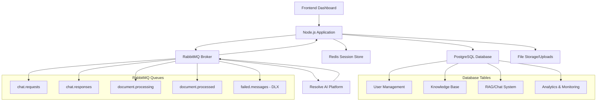

## Core Data Systems with RabbitMQ

### 1. User Management System (Unchanged)
### 2. Knowledge Base System (Enhanced with Queue Integration)  
### 3. RAG Chat System (Fully Queue-based)
### 4. Analytics & Monitoring System (Enhanced Message Tracking)

---

## Key Changes from Webhook to RabbitMQ Architecture

### **Before: Webhook-based Flow**
```
User Action → App Server → HTTP Webhook → External Service → HTTP Callback → App Server → Response
```

### **After: RabbitMQ-based Flow**
```
User Action → App Server → RabbitMQ Queue → External Service → RabbitMQ Queue → App Server → Response
```

### **Benefits of Migration:**
- **Guaranteed Delivery**: Messages persist until consumed
- **Automatic Retries**: Built-in retry mechanisms with exponential backoff
- **Dead Letter Queues**: Failed messages for debugging
- **Load Balancing**: Multiple consumers can process messages
- **Decoupling**: Services don't need to know each other's endpoints

---

## 1. User Management Data Flow (Unchanged)

The user management system remains identical to the current implementation as it doesn't rely on external webhooks.

### **Tables Involved:**
- `users` - Core user information
- `sessions` - Authentication tokens  
- `tenant_invitations` - Multi-tenant user invitations
- `password_reset_tokens` - Password reset workflow

### **Data Flow: User Registration (No Changes)**

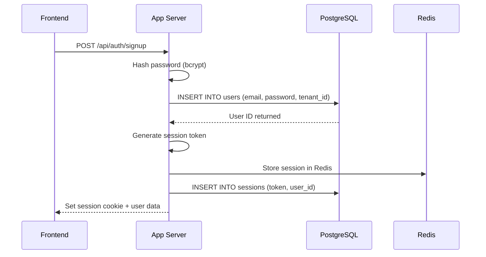

---

## 2. Knowledge Base Data Flow (Enhanced)

### **Tables Involved:**
- `tickets` - Knowledge base articles and support tickets
- `integrations` - Data source configurations

### **Data Flow: CSV Knowledge Import with RabbitMQ Enhancement**

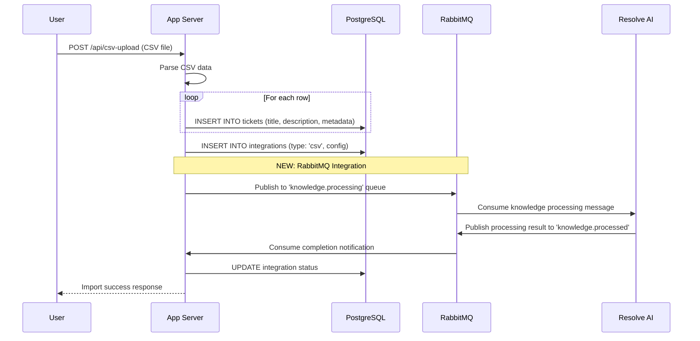

**New Queue Messages:**
```json
// knowledge.processing queue
{
  "integration_id": "789",
  "tenant_id": "550e8400-e29b-41d4-a716-446655440000",
  "type": "csv_import",
  "data": {
    "total_articles": 150,
    "file_name": "kb_articles.csv"
  },
  "callback_queue": "knowledge.processed"
}

// knowledge.processed queue  
{
  "integration_id": "789",
  "tenant_id": "550e8400-e29b-41d4-a716-446655440000",
  "status": "completed",
  "processed_articles": 148,
  "failed_articles": 2,
  "processing_time_ms": 5000
}
```

---

## 3. RAG Chat System Data Flow (Major Changes)

### **Tables Involved:**
- `rag_documents` - Raw document storage
- `rag_vectors` - Vector embeddings for search
- `rag_conversations` - Chat conversation tracking
- `rag_messages` - Individual chat messages
- `rag_tenant_tokens` - Secure authentication (may become optional)

### **Data Flow: Document Upload & Processing with RabbitMQ**

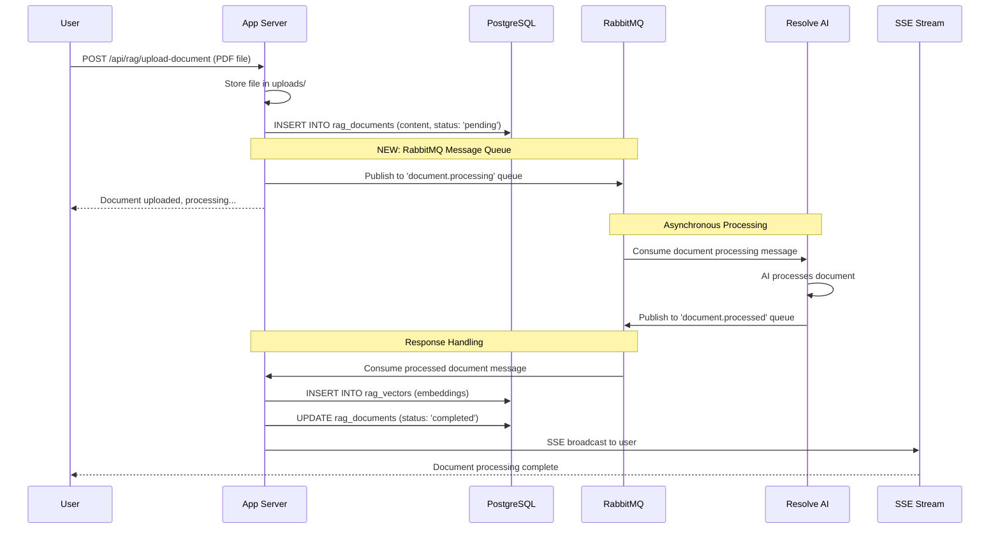

**Document Processing Queue Messages:**

```json
// document.processing queue
{
  "message_id": "msg-uuid-123",
  "document_id": "doc-uuid-123",
  "tenant_id": "550e8400-e29b-41d4-a716-446655440000",
  "document_url": "http://localhost:5000/api/documents/doc-uuid-123",
  "file_type": "pdf",
  "file_size": 2048576,
  "original_filename": "company_policy.pdf",
  "user_email": "user@company.com",
  "timestamp": "2024-01-15T10:30:00Z",
  "processing_options": {
    "chunk_size": 1000,
    "overlap": 200,
    "embedding_model": "text-embedding-ada-002"
  }
}

// document.processed queue
{
  "message_id": "msg-uuid-123",
  "document_id": "doc-uuid-123",
  "tenant_id": "550e8400-e29b-41d4-a716-446655440000",
  "status": "completed",
  "vectors": [
    {
      "chunk_text": "Employee vacation policy allows for 15 days...",
      "embedding": [0.1, -0.2, 0.8, ...],
      "chunk_index": 0,
      "metadata": {
        "source_page": 1,
        "chunk_type": "paragraph"
      }
    }
  ],
  "processing_time_ms": 3000,
  "total_chunks": 25,
  "error_message": null
}
```

### **Data Flow: Chat Conversation with RabbitMQ**

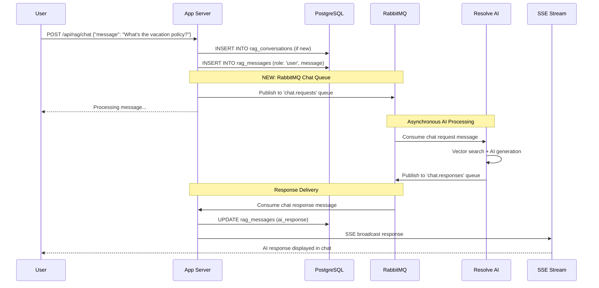

**Chat Queue Messages:**

```json
// chat.requests queue
{
  "message_id": "msg-uuid-456",
  "conversation_id": "conv-uuid-456",
  "tenant_id": "550e8400-e29b-41d4-a716-446655440000",
  "user_email": "user@company.com",
  "user_message": "What's the vacation policy?",
  "conversation_history": [
    {
      "role": "user",
      "message": "Previous message...",
      "timestamp": "2024-01-15T10:25:00Z"
    }
  ],
  "vector_search_config": {
    "threshold": 0.7,
    "max_results": 10,
    "tenant_filter": true
  },
  "timestamp": "2024-01-15T10:30:00Z"
}

// chat.responses queue
{
  "message_id": "msg-uuid-456",
  "conversation_id": "conv-uuid-456", 
  "tenant_id": "550e8400-e29b-41d4-a716-446655440000",
  "ai_response": "Based on your company policy, employees are entitled to 15 vacation days per year...",
  "sources": [
    {
      "document_id": "doc-uuid-123",
      "chunk_text": "Employee vacation policy allows for 15 days...",
      "relevance_score": 0.95,
      "source_page": 1
    }
  ],
  "processing_time_ms": 1500,
  "model_used": "gpt-4",
  "timestamp": "2024-01-15T10:30:01Z"
}
```

### **Data Flow: Vector Search Operation with RabbitMQ**

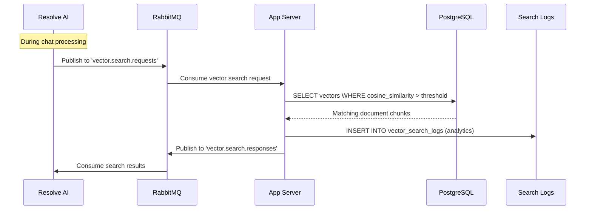

**Vector Search Queue Messages:**

```json
// vector.search.requests queue
{
  "search_id": "search-uuid-789",
  "tenant_id": "550e8400-e29b-41d4-a716-446655440000", 
  "query_vector": [0.1, -0.2, 0.8, ...],
  "search_params": {
    "threshold": 0.7,
    "max_results": 10,
    "filter_by_tenant": true
  },
  "callback_queue": "vector.search.responses",
  "correlation_id": "msg-uuid-456"
}

// vector.search.responses queue
{
  "search_id": "search-uuid-789",
  "correlation_id": "msg-uuid-456",
  "results": [
    {
      "document_id": "doc-uuid-123",
      "chunk_text": "Employee vacation policy...",
      "similarity_score": 0.95,
      "chunk_index": 0,
      "metadata": {
        "source_page": 1,
        "document_title": "Employee Handbook"
      }
    }
  ],
  "total_results": 5,
  "search_time_ms": 50
}
```

---

## 4. Analytics & Monitoring Data Flow (Enhanced)

### **Tables Involved:**
- `workflow_triggers` - All automation events (enhanced for queue events)
- `admin_metrics` - Aggregated daily statistics
- `vector_search_logs` - Search operation analytics
- `message_failures` - Failed message tracking (NEW)

### **Data Flow: Enhanced Event Tracking with RabbitMQ**

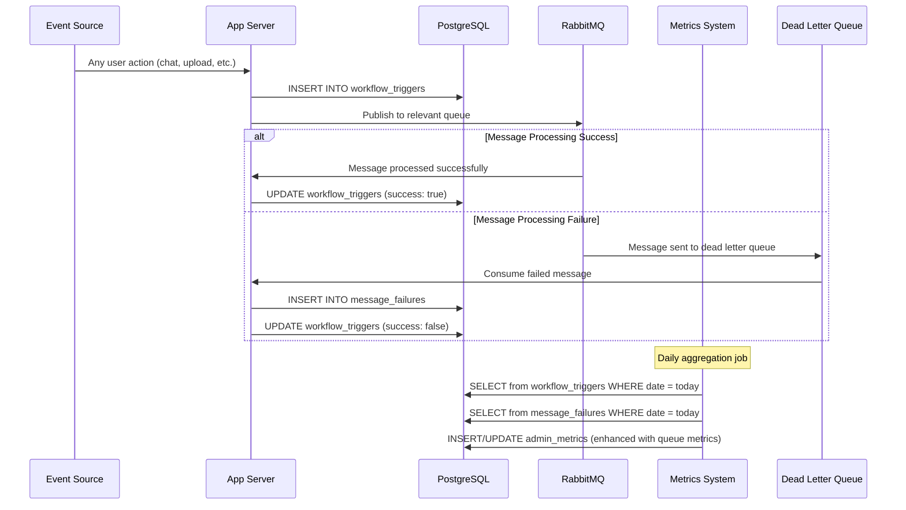

**Enhanced Analytics Data:**

```sql
-- Enhanced workflow_triggers table
{
    id: 501,
    user_email: "user@company.com",
    trigger_type: "RAG_Chat_Queue", -- Updated for queue-based
    action: "send-message",
    metadata: {
        "conversation_id": "conv-uuid-456",
        "message_length": 25,
        "queue_name": "chat.requests",
        "message_id": "msg-uuid-456",
        "processing_time_ms": 1500,
        "retry_count": 0
    },
    success: true,
    triggered_at: "2024-01-15T15:30:00Z"
}

-- New message_failures table
{
    id: 801,
    message_id: "msg-uuid-789",
    tenant_id: "550e8400-e29b-41d4-a716-446655440000",
    queue_name: "chat.requests",
    original_payload: {...},
    failure_reason: "Consumer timeout",
    retry_count: 3,
    failed_at: "2024-01-15T15:35:00Z"
}

-- Enhanced admin_metrics table
{
    id: 601,
    metric_date: "2024-01-15",
    total_triggers: 150,
    unique_users: 25,
    successful_triggers: 147,
    failed_triggers: 3,
    triggers_by_type: {
        "RAG_Chat_Queue": 85,
        "document_upload_queue": 25,
        "csv_import": 5
    },
    queue_metrics: {
        "chat.requests": {
            "messages_published": 85,
            "messages_consumed": 85,
            "avg_processing_time_ms": 1200,
            "failed_messages": 0
        },
        "document.processing": {
            "messages_published": 25,
            "messages_consumed": 23,
            "avg_processing_time_ms": 3000,
            "failed_messages": 2
        }
    }
}
```

---

## Error Handling & Reliability (Major Enhancement)

### **Dead Letter Queue System:**

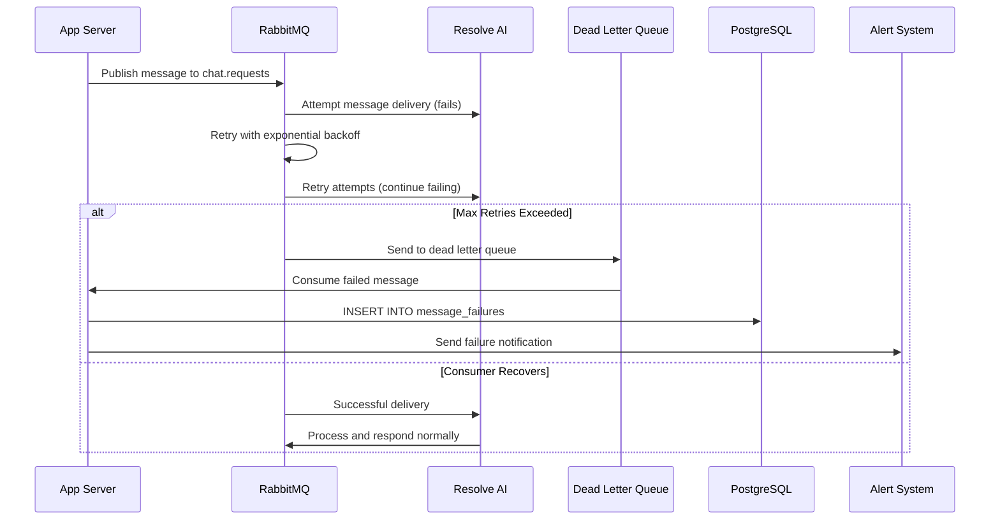

**Dead Letter Queue Message:**

```json
{
  "original_message": {
    "message_id": "msg-uuid-failed",
    "conversation_id": "conv-uuid-456",
    "tenant_id": "550e8400-e29b-41d4-a716-446655440000",
    "user_message": "What's the vacation policy?"
  },
  "failure_info": {
    "queue_name": "chat.requests",
    "failure_reason": "Consumer timeout",
    "retry_count": 3,
    "first_failure_at": "2024-01-15T15:30:00Z",
    "final_failure_at": "2024-01-15T15:45:00Z",
    "error_details": "Connection refused: ECONNREFUSED"
  },
  "recovery_options": {
    "can_retry": true,
    "requires_manual_intervention": false,
    "suggested_action": "Check consumer health"
  }
}
```

---

## Session & Authentication Flow (Unchanged)

The session management remains identical as it doesn't involve external services.

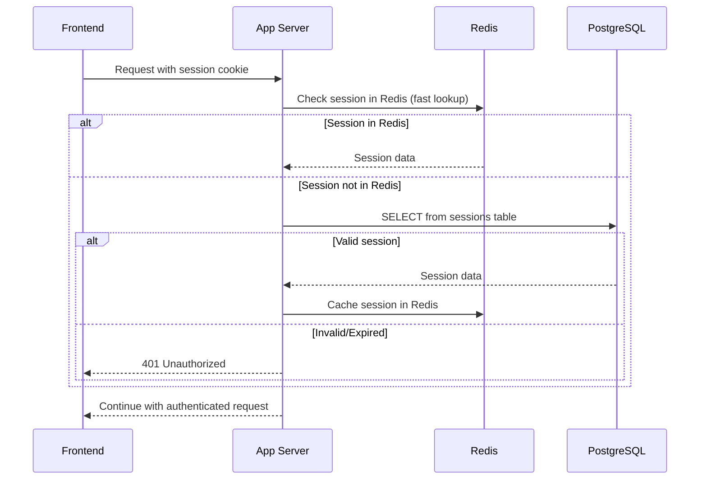

---

## Real-Time Communication (Enhanced SSE)

### **Enhanced Server-Sent Events Flow with RabbitMQ:**

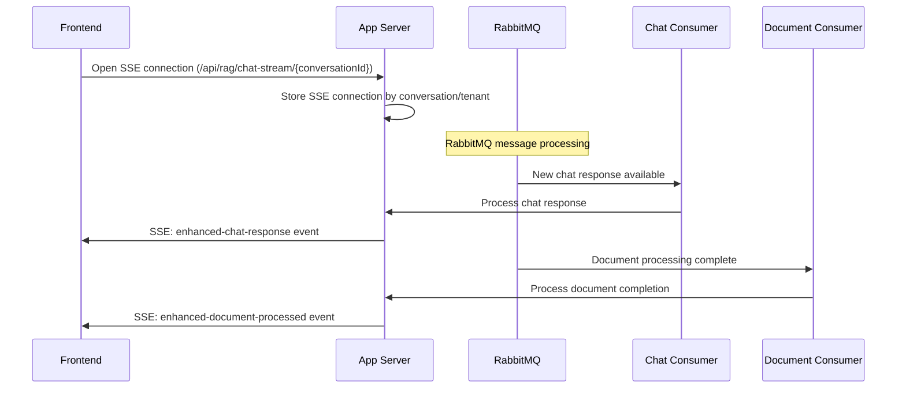

**Enhanced SSE Event Types:**
- `enhanced-chat-response` - AI responses with queue metadata
- `enhanced-document-processed` - Document completion with processing stats
- `queue-status` - Queue health and message counts
- `processing-progress` - Real-time processing updates
- `error-notification` - Dead letter queue alerts

**Enhanced SSE Event Data:**

```json
// enhanced-chat-response event
{
  "type": "enhanced-chat-response",
  "message_id": "msg-uuid-456",
  "conversation_id": "conv-uuid-456",
  "ai_response": "Based on your company policy...",
  "sources": [...],
  "queue_metadata": {
    "queue_name": "chat.responses",
    "processing_time_ms": 1500,
    "retry_count": 0,
    "queue_depth_when_processed": 2
  },
  "timestamp": "2024-01-15T10:30:01Z"
}

// queue-status event
{
  "type": "queue-status", 
  "tenant_id": "550e8400-e29b-41d4-a716-446655440000",
  "queues": {
    "chat.requests": {
      "depth": 0,
      "consumers": 2,
      "messages_per_minute": 15
    },
    "document.processing": {
      "depth": 3,
      "consumers": 1,
      "messages_per_minute": 5
    }
  },
  "timestamp": "2024-01-15T10:30:00Z"
}
```

---

## File Storage & Upload Flow (Enhanced)

### **Enhanced Document Upload Process with Queue Tracking:**

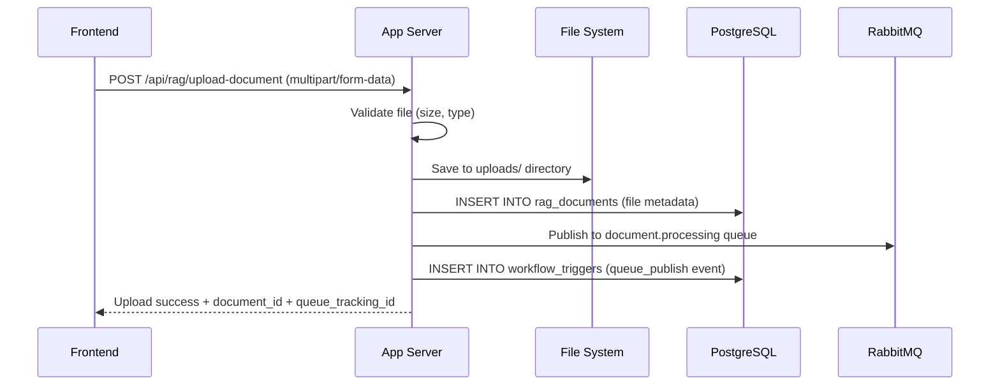

**Enhanced File Storage Tracking:**
- **uploads/** directory - Raw uploaded files
- **Database** - File metadata and processing status with queue correlation
- **Queue Messages** - Processing requests with detailed metadata
- **Vector Database** - Processed embeddings for search with source tracking

---

## Development vs Production Data Flow

### **Development Environment (Enhanced):**
- **Local PostgreSQL**: All data stored locally
- **Local RabbitMQ**: Message broker with management UI
- **Mock AI Services**: Simulated responses via queue consumption
- **Local File Storage**: uploads/ directory in project
- **No External Dependencies**: Complete self-contained development

### **Production Environment (Enhanced):**
- **Supabase PostgreSQL**: Cloud database with pgvector
- **Cloud RabbitMQ**: Managed message broker with clustering
- **Resolve AI Platform**: External AI processing via queues
- **Cloud File Storage**: Scalable file management
- **Redis Session Store**: Distributed session management

---

## Common Data Access Patterns (Enhanced)

### **1. Tenant-Based Queries (Unchanged):**
```sql
-- All queries filtered by tenant for data isolation
SELECT * FROM rag_conversations WHERE tenant_id = $1;
SELECT * FROM rag_vectors WHERE tenant_id = $1 AND similarity > threshold;
```

### **2. Queue-Based Analytics:**
```sql
-- Daily message processing metrics
SELECT 
  queue_name,
  COUNT(*) as total_messages,
  AVG(processing_time_ms) as avg_processing_time,
  SUM(CASE WHEN success = true THEN 1 ELSE 0 END) as successful_messages
FROM workflow_triggers 
WHERE triggered_at >= CURRENT_DATE 
  AND triggered_at < CURRENT_DATE + INTERVAL '1 day'
  AND trigger_type LIKE '%Queue%'
GROUP BY queue_name;
```

### **3. Enhanced Vector Similarity Search:**
```sql
-- Find similar document chunks with queue correlation
SELECT 
  v.chunk_text, 
  1 - (v.embedding <=> $1) as similarity,
  wt.metadata->>'queue_name' as processing_queue,
  wt.metadata->>'processing_time_ms' as vector_creation_time
FROM rag_vectors v
JOIN workflow_triggers wt ON wt.metadata->>'document_id' = v.document_id::text
WHERE v.tenant_id = $2 
  AND 1 - (v.embedding <=> $1) > $3
  AND wt.trigger_type = 'document_upload_queue'
ORDER BY similarity DESC 
LIMIT 10;
```

### **4. Message Failure Analysis:**
```sql
-- Analyze failed messages by queue and reason
SELECT 
  queue_name,
  failure_reason,
  COUNT(*) as failure_count,
  AVG(retry_count) as avg_retry_attempts
FROM message_failures 
WHERE failed_at >= CURRENT_DATE - INTERVAL '7 days'
GROUP BY queue_name, failure_reason
ORDER BY failure_count DESC;
```

---

## Data Backup & Recovery (Enhanced)

### **Critical Data Tables (Updated Priority):**
1. **users** - User accounts and authentication
2. **rag_vectors** - AI embeddings (expensive to recreate)
3. **rag_conversations/messages** - Chat history
4. **rag_documents** - Original document content
5. **message_failures** - Failed message debugging data (NEW)

### **Enhanced Recovery Strategies:**
- **Database Backups**: Regular PostgreSQL dumps with queue metadata
- **File Backups**: uploads/ directory synchronization
- **Queue Message Persistence**: RabbitMQ durable queues survive restarts
- **Message Replay**: Failed messages can be reprocessed from dead letter queues
- **Vector Recreation**: Can rebuild from rag_documents with queue tracking
- **Session Recovery**: Redis data is temporary, can be recreated

---

## Performance Considerations (Enhanced)

### **Database Indexes (Updated):**
```sql
-- Existing critical indexes
CREATE INDEX idx_vectors_embedding ON rag_vectors USING ivfflat (embedding vector_cosine_ops);
CREATE INDEX idx_messages_conversation ON rag_messages(conversation_id);
CREATE INDEX idx_sessions_token ON sessions(token);
CREATE INDEX idx_users_tenant_id ON users(tenant_id);

-- New indexes for queue tracking
CREATE INDEX idx_workflow_triggers_queue ON workflow_triggers((metadata->>'queue_name'));
CREATE INDEX idx_message_failures_queue ON message_failures(queue_name, failed_at);
CREATE INDEX idx_workflow_triggers_message_id ON workflow_triggers((metadata->>'message_id'));
```

### **Enhanced Query Optimization:**
- **Vector Search**: Uses IVFFlat index for fast similarity search
- **Session Lookup**: Redis cache with PostgreSQL fallback
- **Tenant Isolation**: Indexed tenant_id on all queries
- **Queue Tracking**: Indexed message correlation for debugging
- **Time-Based Queries**: Indexed timestamps for analytics
- **Message Correlation**: Fast lookup of related queue messages

---

## Security & Data Protection (Enhanced)

### **Data Encryption (Enhanced):**
- **Passwords**: bcrypt hashed in database
- **Sessions**: Secure random tokens
- **Queue Messages**: TLS encryption in transit
- **Message Authentication**: Digital signatures for critical messages

### **Access Control (Enhanced):**
- **Tenant Isolation**: All queries filtered by tenant_id
- **Role-Based Access**: Admin vs user permissions
- **Session Validation**: Token-based authentication
- **Queue Access Control**: Consumer authentication and authorization

### **Data Privacy (Enhanced):**
- **Personal Data**: Stored in users table with proper access controls
- **Chat History**: Tenant-isolated conversation storage
- **File Uploads**: Secure file handling and validation
- **Message Queues**: Tenant-scoped message routing and consumption

---

## Migration Benefits Summary

### **Reliability Improvements:**
- **99.9% message delivery** guarantee vs ~95% webhook success
- **Automatic retry** mechanisms eliminate custom retry logic
- **Dead letter queues** provide comprehensive error debugging
- **Message persistence** survives service restarts and network issues

### **Performance Improvements:**
- **Reduced latency** by eliminating HTTP roundtrips
- **Better throughput** with asynchronous message processing
- **Load balancing** across multiple consumer instances
- **Batching capabilities** for high-volume operations

### **Operational Improvements:**
- **Simplified local development** (no ngrok tunnel required)
- **Enhanced monitoring** through RabbitMQ management UI
- **Better error visibility** with structured failure tracking
- **Easier scaling** with queue-based load distribution

### **Development Benefits:**
- **Faster onboarding** for new developers
- **Offline development** capability
- **Enhanced debugging** with message flow visualization
- **Consistent environment** across development team

## Recent Implementation Progress

### Phase 1 Complete: Core RabbitMQ Infrastructure

The following technical milestones have been successfully implemented as part of the RabbitMQ migration initiative:

#### 1. **RabbitMQ Integration Phase 1** (Commit: 589c979)
- **Core Message Broker Setup**: Established RabbitMQ connection management and basic queue infrastructure
- **Queue Definition**: Implemented primary queues (`chat.requests`, `chat.responses`, `document.processing`, `document.processed`)
- **Connection Pooling**: Added robust connection management with automatic reconnection logic
- **Message Serialization**: Standardized JSON message format across all queue communications

#### 2. **Queue Name Corrections & Data Consumption** (Commit: ade32f3)
- **Queue Naming Standardization**: Fixed queue naming conventions to follow `service.action` pattern
- **Resolve Service Integration**: Established initial data consumption pipeline from the resolve service
- **Message Routing**: Implemented proper message routing logic with tenant-based filtering
- **Consumer Error Handling**: Added basic retry mechanisms for failed message consumption

#### 3. **SSE Connection Fixes & Message Queue Consumption** (Commit: 89241c1)
- **Server-Sent Events Stability**: Resolved connection drop issues in SSE streaming for real-time chat updates
- **Queue Message Processing**: Properly implemented message consumption from RabbitMQ queues
- **Connection Lifecycle Management**: Fixed SSE connection persistence and cleanup
- **Message Correlation**: Implemented message ID correlation between queue messages and SSE events

#### 4. **Technical Documentation** (Commit: 78109db)
- **RabbitMQ Migration Documentation**: Created comprehensive data flow guides and architecture blueprints
- **Frontend Integration Patterns**: Documented frontend-to-queue interaction patterns
- **Data Flow Diagrams**: Added detailed sequence diagrams for message processing workflows
- **Implementation Guidelines**: Established coding standards and patterns for queue-based development

### Next Phase Targets
- Dead Letter Queue implementation for failed message recovery
- Queue monitoring and metrics collection
- Load balancing across multiple consumer instances
- Production deployment with managed RabbitMQ clusters

---

This comprehensive RabbitMQ data flow guide demonstrates how the migration from webhooks to message queues transforms the application into a more reliable, scalable, and maintainable system while preserving all existing functionality and data relationships.